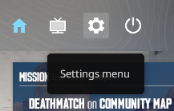
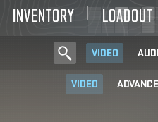
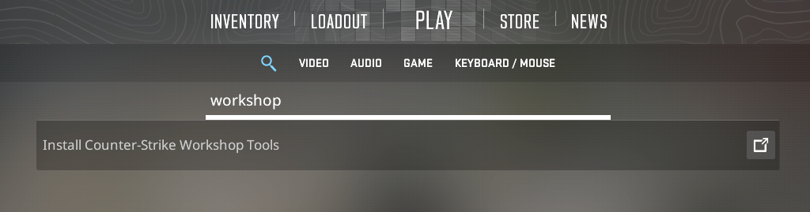
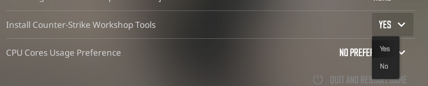

1. Launch <Game name="cs2" /> from **Steam**.  
2. Click on the **Settings menu**. 
3. Search for **Install Counter-Strike Workshop Tools**.
4. Change the setting to **Yes**.

  
  
  
  

After this quit out of the game, and wait for the workshop tools to install.
