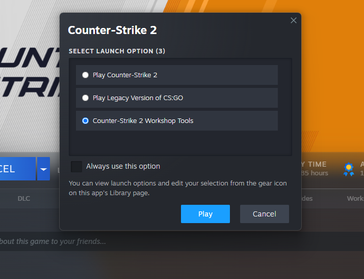
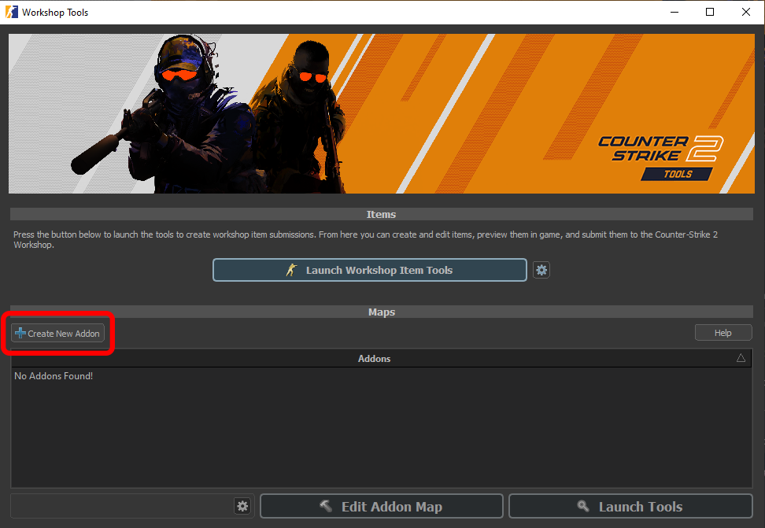
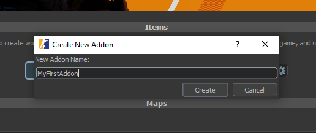
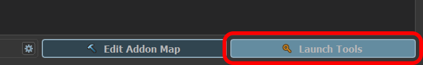

The Addon Launcher is reached from the game's startup menu:

1. Launch <Game name="cs2" /> from Steam.  
2. In the startup menu, select **Counter-Strike 2 Workshop Tools**.  

:::info
The Addon Launcher can also be started directly from the installation directory:  
`game/bin/win64/csgocfg.exe`  
:::

  

In the launcher:

- Click on **Create New Addon**.  
- Give your addon a **name** and click **Create**. 
- Click on **Launch Tools** to open the Workshop tools.  

:::danger
Make sure to press on **Launch Tools** and NOT **Edit Addon Map**, the latter is broken and should not be used!
:::

  
  
  
