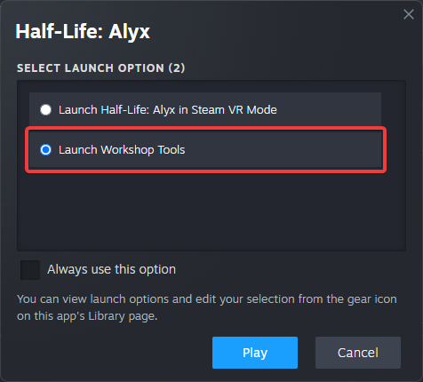
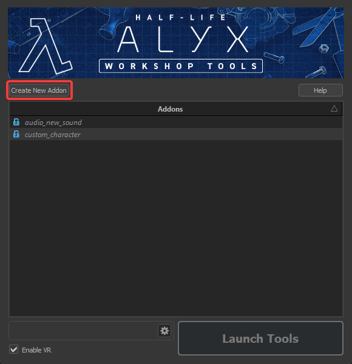
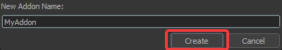
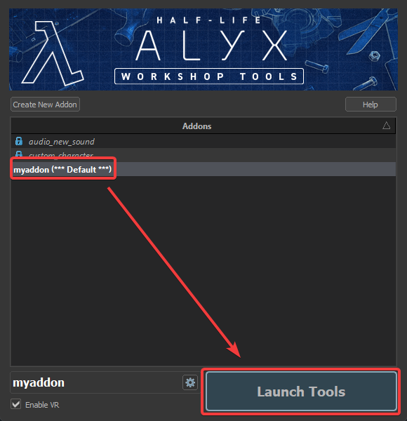

The Addon Launcher is reached from the game's startup menu:

1. Launch <Game name="hla" /> from Steam.  
2. In the startup menu, select **Tools**.  

:::info
The Addon Launcher can also be started directly from the installation directory:  
`game/bin/win64/hlvrcfg.exe`  
:::

  

In the launcher, create a new addon, then open the tools with **Launch Tools**.

  
  

