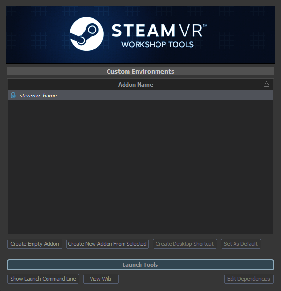

The Addon Launcher is an executable in the SteamVR install rather than a startup menu entry:

`SteamVR\tools\steamvr_environments\game\bin\win64\steamtourscfg.exe`

It creates and launches addons the same way the other games do.

