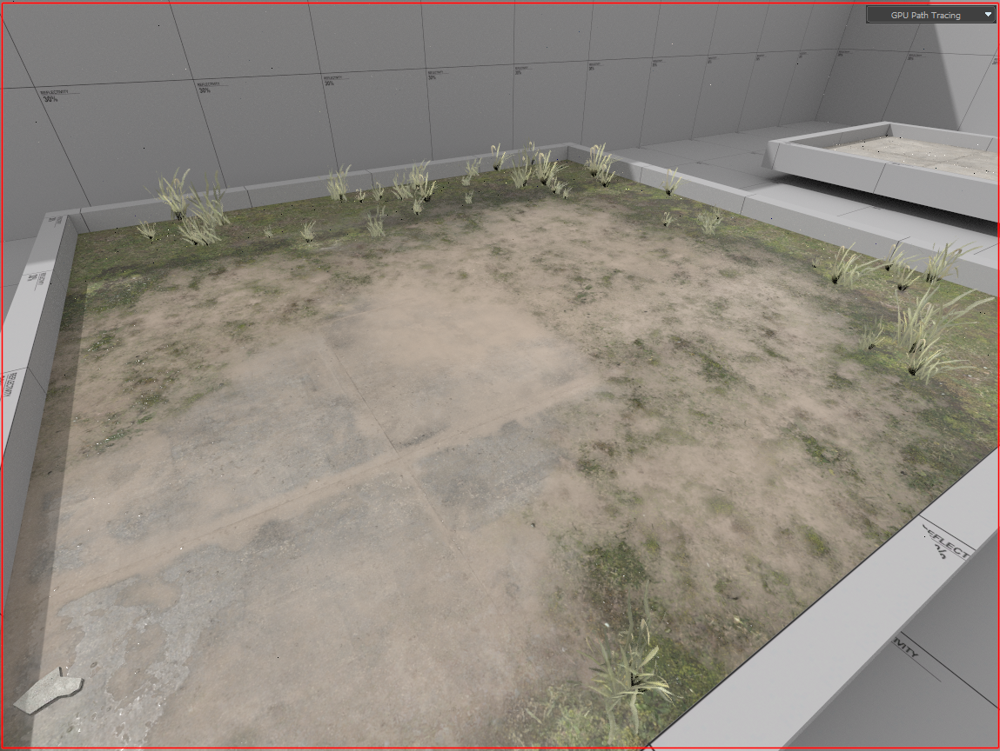
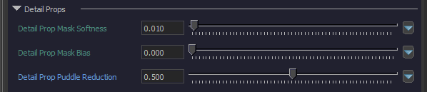
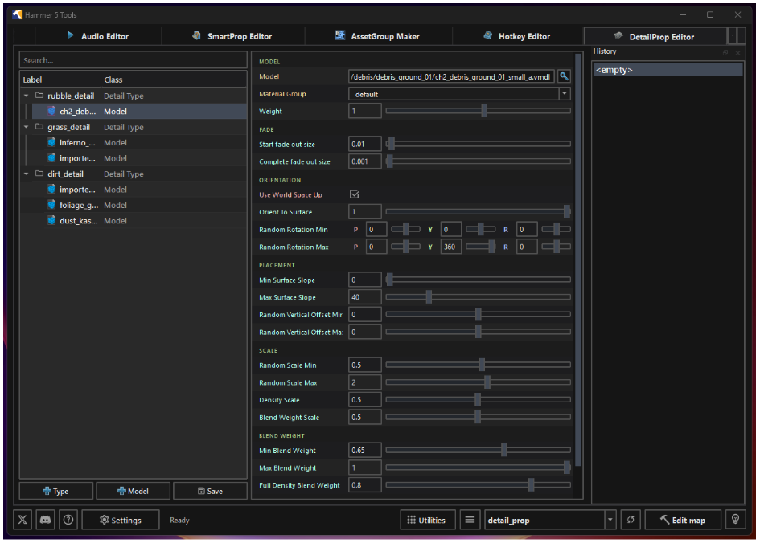

## Description

Detail Props are non-solid models placed on environment blend shader materials automatically. Placement can be controlled using material blending. 

On top of fading out at a distance they are rendered and culled directly on the GPU, which makes them suitable for dense foliage which otherwise would create too many drawcalls (this is how they are used on the CS2 Cache remake).

:::info
Downloading the example addon to follow along is recommended.

The Detail Props example created for this guide is posted on the [workshop](https://steamcommunity.com/sharedfiles/filedetails/?id=3774744355). A zip file of the raw Addon is also [available here](https://www.mediafire.com/file/zpjw0h52meaqrlh/detail_prop.zip/file).

A template for `detail_prop_types` with default values can be found [at the bottom of this page](#blank-template).
:::



---

## Usage

A complete description and walkthrough of the file format can be found on the [CS2 detail props vdata page](../../FileFormats/cs2_detail_props/index.mdx).

---

## Detail Prop Puddle Reduction

When the wetness layer is enabled, You can reduce model placement with puddle blending.



Seen below with detail type `grass_detail`, model placement is reduced by `0.50`.


---

## Hammer5Tools

For a 3rd party tool instead of editing `detail_prop_types.vdata` directly, one has been created by `dertwist`. 



:::info
`Hammer5Tools` is available on their [website](https://hammer5tools.github.io/) or on [GitHub](https://github.com/dertwist/Hammer5Tools)
:::

---

## Blank Template

:::info
A template of default values can be taken from below. Copy/Paste this to a new text file and save as `detail_prop_types.vdata`. 
:::

```cpp
<!-- kv3 encoding:text:version{e21c7f3c-8a33-41c5-9977-a76d3a32aa0d} format:generic:version{7412167c-06e9-4698-aff2-e63eb59037e7} -->
{
	generic_data_type = "CDetailPropType"
	example_detail = 
	{
		m_flDensity = 1.0
		m_Models = 
		[
			
			{
				m_ModelName = resource_name:""
				m_MaterialGroup = ""
				m_flWeight = 1.0
				m_flStartFadeSize = 0.02
				m_flEndFadeSize = 0.0125
				m_bWorldSpaceOrientation = false
				m_flOrientToSurface = 1.0
				m_flMinSurfaceSlope = 0.0
				m_flMaxSurfaceSlope = 180.0
				m_flRandomVerticalOffsetMin = 0.0
				m_flRandomVerticalOffsetMax = 0.0
				m_vRandomRotationMin = 
				[
					0.000000,
					0.000000,
					0.000000,
				]
				m_vRandomRotationMax = 
				[
					0.000000,
					360.000000,
					0.000000,
				]
				m_flRandomScaleMin = 1.0
				m_flRandomScaleMax = 1.0
				m_flDensityMinScale = 1.0
				m_flBlendWeightMinScale = 1.0
				m_flBlendWeightMin = 0.25
				m_flBlendWeightMax = 1.0
				m_flBlendWeightFullDenstity = 0.75
				m_bCastStaticShadows = false
			}
		]
	}
}

```

---
