Detail Props are non solid models that are placed upon environment blend shader materials automatically. They will fade out in the distance based on a percentage of screen space size for performance. Detail Props are ideal for adding small “details” to your map in the form of small models on the surfaces of your materials. Detail props placement can be controlled with blending your environment blend shader materials as well. I recommend downloading the addon to experiment with or follow along. Check example links for workshop or addon zip download.


---

## Usage

Detail Props are defined within a kv3 encoded text document named `detail_prop_types.vdata` that needs to be located in the scripts folder of your addon like so. 

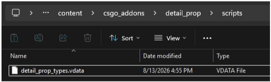

The detail types in this file define what models will be placed and how they will be placed on your environment blend shader material. They will become selectable options in the material editor here

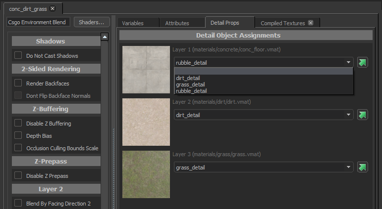

Within the vdata text file, a detail type is defined in 2 segments of parameters. A preview of one detail type with 1 model is below. 

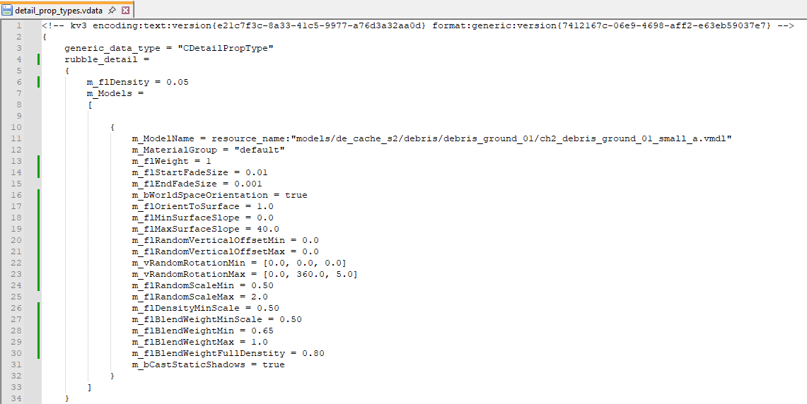

---

## CDetailPropType

The first parameter defined `rubble_detail` is the name of the detail type which will be selectable within your environment blend shader material. 


---

## m_flDensity

The second parameter defined is `m_flDensity = 0.05`


This value defines the density coverage of models placed on your material per square foot.


---

## m_ModelName = resource_name:

Moving on to the second segment of parameters to define the model and how it is placed on materials, the first parameter is the model file location.
`m_ModelName = resource_name:`

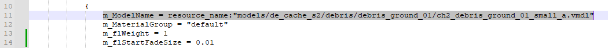

The locations can be easily found in the object properties window in hammer. Replace the file path entry with the model you wish to use for the detail type.

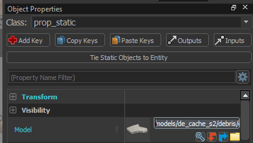

---

## m_MaterialGroup

The next parameter defined is the material group (or skin) to use for the model chosen.
`m_MaterialGroup = "default"` 


The debris model has 2 skins to choose from, though for the example default was chosen.


---

## m_flWeight

Moving on, the next parameter in the text file is `m_flWeight = 1`


This parameter is a weight that determines the frequency of this model being placed relative to other models in the detail type. Since there is only 1 model for the `rubble_detail` detail type, the value is 1. 

Though this parameter can be split up amongst more models if defined. Below the first model is weighted to be placed 96% of the time, while the second model is weighted to be placed 4% of the time. Taken from the `grass_detail` detail type in the example.

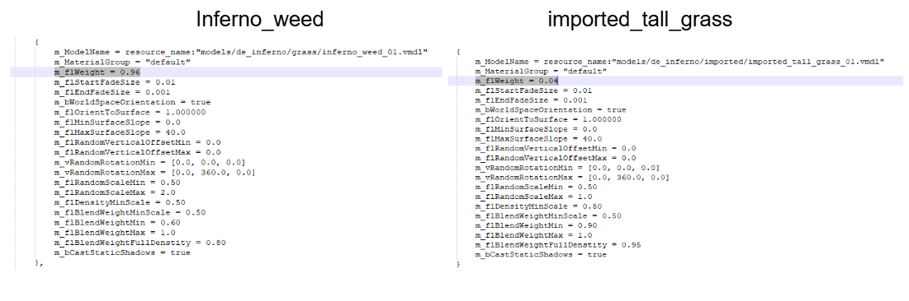


---

## m_flStartFadeSize
## m_flEndFadeSize

Next, we have 2 parameters for the start and end of fade size. Detail Props will begin to fade from sight once they reach the defined start size and no longer be visible at the defined end size. 

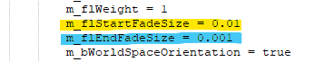

`m_flStartFadeSize = 0.01`    models smaller than 0.01 of screen space will begin to fade.

`m_flEndFadeSize = 0.001`     models smaller than 0.001 of screen space will finish fading.

Make sure to noclip around the provided example addon to see the fading in action. The map is a 2048x2048 square so that when in the corners of the map, the fade should be noticeable. As well as on the long rectangle examples created, seen below. Keep in mind that fade size is directly affected by the size of the models. You will notice this difference between layer 2 and layer 3 examples.


---

## m_bWorldSpaceOrientation
## m_flOrientToSurface

The 2 parameters following simply describe how your models decide which way is up when placed and how to be placed.


`m_bWorldSpaceOrientation = true`

When true, the model will use world space to align its Z direction, so as not to affect surface slope filtering. Set to True or False

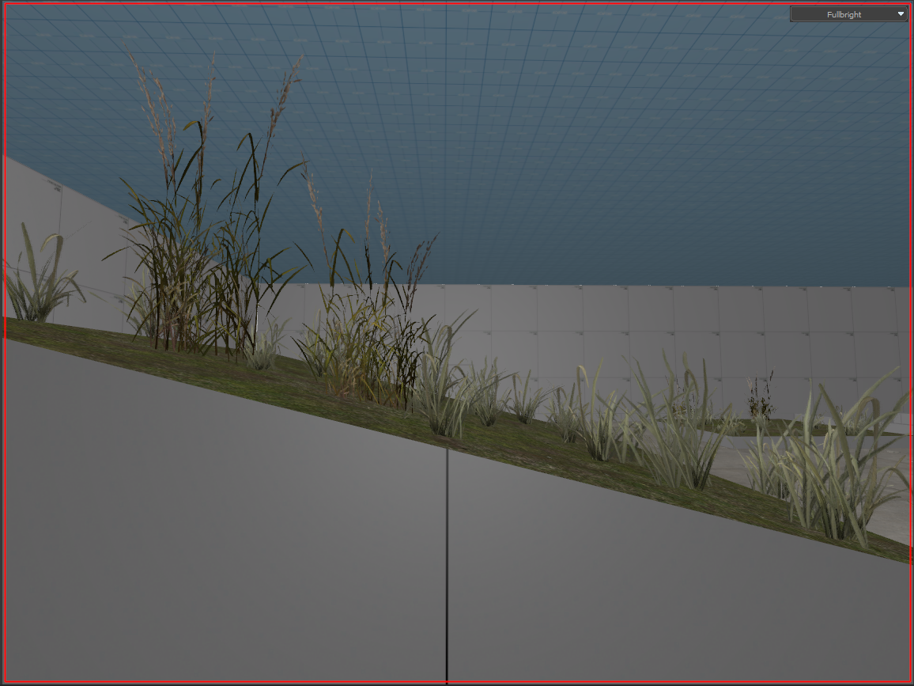

`m_flOrientToSurface = 1.000000`
When set to 1.0 this parameter tells the model to match its Z up direction to the surface where placed as seen below. Set to 0 or 1. 


---

## m_flMinSurfaceSlope
## m_flMaxSurfaceSlope

Half way there. These next 2 parameters define the minimum and maximum range of surface angles the models will be placed within. 

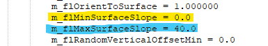

In short, slope can range from 0 - 180. Where 0 is horizontal, 90 is a vertical wall, while 180 would be an upside down surface like the ceiling! In the example, models will not be placed when surface angle exceeds 40 degrees.

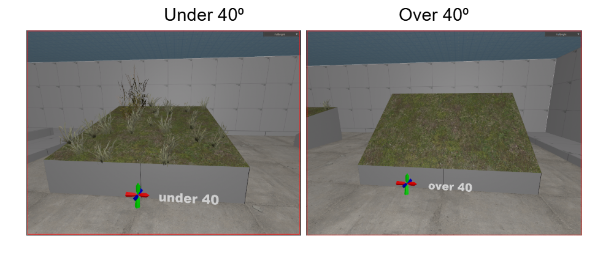

---

## m_flRandomVerticalOffsetMin 
## m_flRandomVerticalOffsetMax

The following parameters are for defining a desired range of random vertical offsets to apply for placement of models. In the example both are set to 0 for surface visuals.


With `m_flRandomVerticalOffsetMin = 10.0` and `m_flRandomVerticalOffsetMax = 50.0` though one can see the results below. 

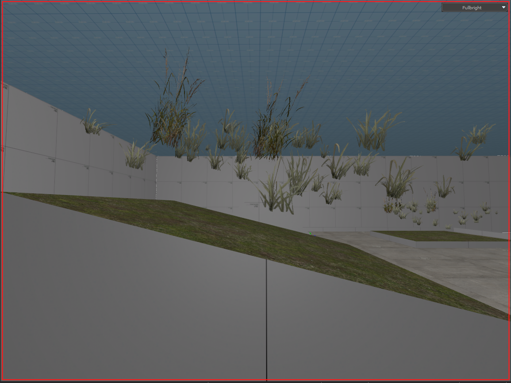

---

## m_vRandomRotationMin
## m_vRandomRotationMax

These 2 parameters describe the minimum and maximum random rotation angles applied to a models local space in pitch, yaw, roll.

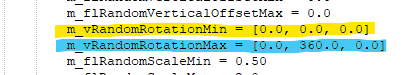


---

## m_flRandomScaleMin
## m_flRandomScaleMax

Much like the previous parameters, these two define the random minimum scale and the random maximum scale size to apply to models.


Below you can see the debris model ranges from a scale of 0.5 - 2.0 as defined.


---

## m_flDensityMinScale

This parameter defines the minimum density scale to apply to models for blended detail density placement. This value is multiplied with the random min scale value AND the minimum blend weight scale value to determine the final minimum scale of placement. 


As a test in the example, all three of the following parameters are set to the same value of `0.50` to ensure the minimum scale of model density placement is `0.50`

`m_flRandomScaleMin = 0.50`

`m_flDensityMinScale = 0.50`

`m_flBlendWeightMinScale = 0.50`

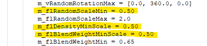

Notice through all three blending examples on the map, models in all three detail types `rubble_detail` , `dirt_detail` , `grass_detail` maintain a minimum scale density placement of `0.50` by setting all 3 paramaters to the same value.

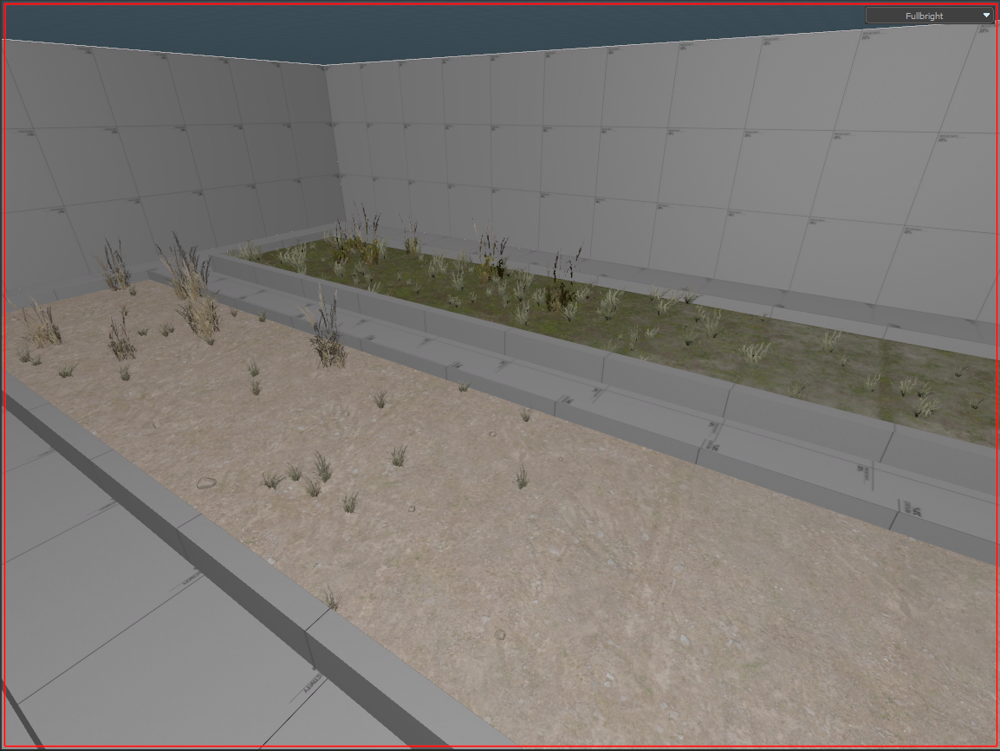

---

## m_flBlendWeightMinScale
## m_flBlendWeightMin


These 2 parameters are directly tied to each other. The parameter `m_flBlendWeightMinScale = 0.50`  for blend weight min scale is exactly as it sounds, defining the minimum scale a model will be when placed WHEN the environment shader is blended to the minimum blend weight value defined `m_flBlendWeightMin = 0.65`.


So in the example of detail type `grass_detail` , the 2 models will only begin to be placed at a minimum scale of `0.50` when layer 2 of the environment blend shader reaches `65%` blend coverage.

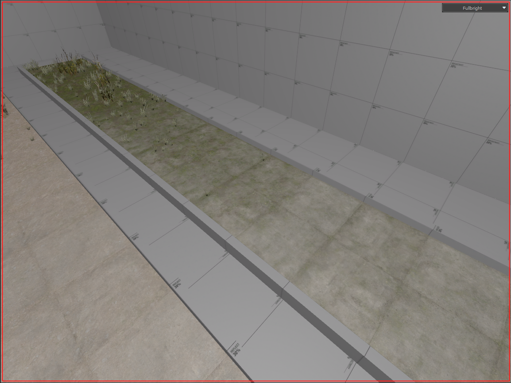

---

## m_flBlendWeightMin
## m_flBlendWeightMax
## m_flBlendWeightFullDenstity

Along with 1 of the previous parameters, all 3 of the above are related to each other. In order to describe a range from which blend weight should models be placed. As well as at what blend weight should model placement be full density defined. 

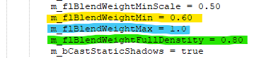

`m_flBlendWeightMin = 0.65` defines the minimum blend weight that models will begin to be placed in is 65% for the example. 

`m_flBlendWeightMax = 1.0` defines the maximum blend weight that models will be placed in is 100% for the example. 

`m_flBlendWeightFullDenstity = 0.80` defines that only at 80% blend weight will models be placed at full density.

With the environment blend shader opened in the Material Editor, we can better visualize this with `Visualizations` enabled to `Show Blending`.

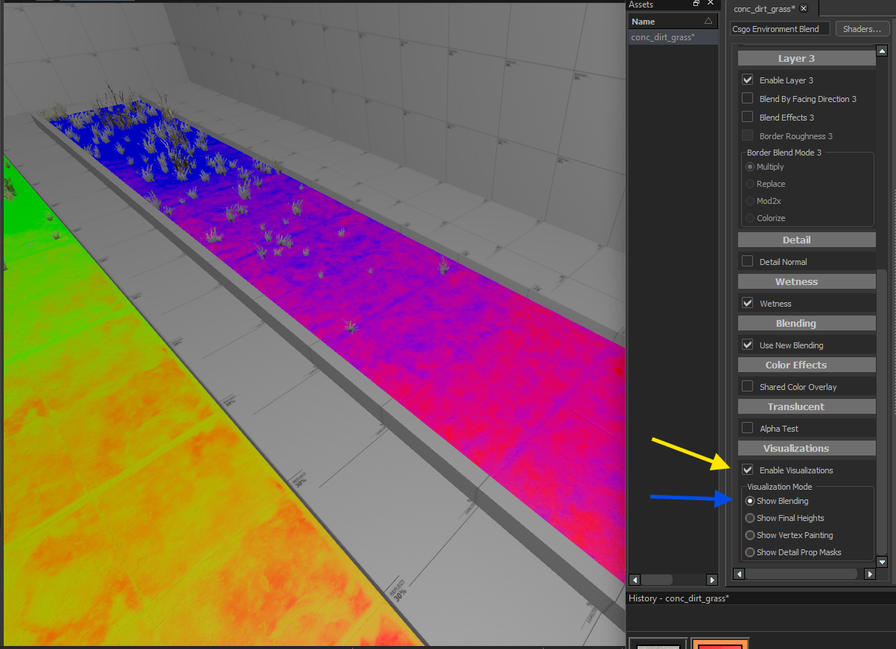

---

## m_bCastStaticShadows

The final parameter of the segment defines whether or not the models placed in the detail type should cast static shadows or not. This is important to remember that if set to True like the example, the static shadows will persist whether the models are visible or not from their defined fade distances!

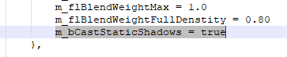

`Notice in the example that past the fade distance, the static shadows are still visible. Keep this in mind for your use case!`

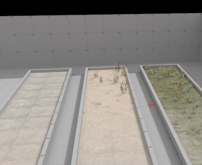

---

## Detail Prop Puddle Reduction


In the Material Editor, each layer of the environment blend shader has a useful setting for puddle blending when wetness layer is enabled. The behavior is exactly as it sounds, how much to reduce model placement based on puddle blending!


As seen below with detail type grass_detail , model placement is reduced by 0.50 where puddles are present on the material.


---

## Hammer5Tools

Now you understand editing `detail_prop_types.vdata`. If you would prefer a 3rd party tool for editing vdata files, one has been created by a community member `dertwist`. Hammer5tools features a Detail Prop editor seen below. 


You can check out `Hammer5Tools` at their [website](https://hammer5tools.github.io/) or [GitHub](https://github.com/dertwist/Hammer5Tools)

---

## Example Links

The Detail Props example created for this guide is posted on the [workshop](https://steamcommunity.com/sharedfiles/filedetails/?id=3774744355)

A zip file of the raw Addon is also [available](https://www.mediafire.com/file/zpjw0h52meaqrlh/detail_prop.zip/file)

---
 
## Blank Template

Alternatively, a template of default values can also be taken from below. Copy/Paste this to a new text file and save as `detail_prop_types.vdata` . 

```cpp
<!-- kv3 encoding:text:version{e21c7f3c-8a33-41c5-9977-a76d3a32aa0d} format:generic:version{7412167c-06e9-4698-aff2-e63eb59037e7} -->
{
	generic_data_type = "CDetailPropType"
	example_detail = 
	{
		m_flDensity = 1.0
		m_Models = 
		[
			
			{
				m_ModelName = resource_name:""
				m_MaterialGroup = ""
				m_flWeight = 1.0
				m_flStartFadeSize = 0.02
				m_flEndFadeSize = 0.0125
				m_bWorldSpaceOrientation = false
				m_flOrientToSurface = 1.0
				m_flMinSurfaceSlope = 0.0
				m_flMaxSurfaceSlope = 180.0
				m_flRandomVerticalOffsetMin = 0.0
				m_flRandomVerticalOffsetMax = 0.0
				m_vRandomRotationMin = 
				[
					0.000000,
					0.000000,
					0.000000,
				]
				m_vRandomRotationMax = 
				[
					0.000000,
					360.000000,
					0.000000,
				]
				m_flRandomScaleMin = 1.0
				m_flRandomScaleMax = 1.0
				m_flDensityMinScale = 1.0
				m_flBlendWeightMinScale = 1.0
				m_flBlendWeightMin = 0.25
				m_flBlendWeightMax = 1.0
				m_flBlendWeightFullDenstity = 0.75
				m_bCastStaticShadows = false
			}
		]
	}
}

```

---


