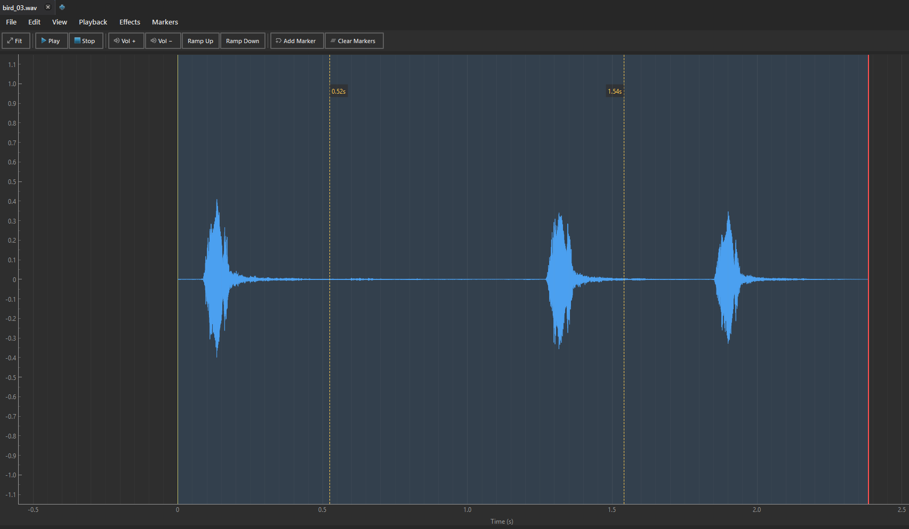
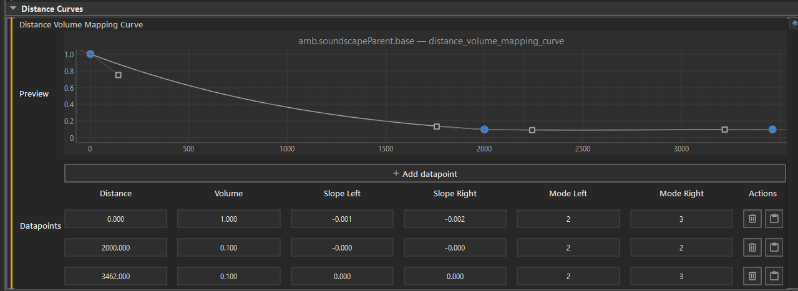

This guide prepares looping music, ambient radios, and soundscapes for <Game name="cs2"/>.

This guide is made using <Tool name="hammer5tools"/>, with its
[Audio Editor](../../ExternalTools/Hammer5Tools/editors/audio-editor.mdx) for the loop marks and its
[SoundEvent Editor](../../ExternalTools/Hammer5Tools/editors/sound-editor.mdx) for the sound event.
Any editor that writes RIFF cue points and any tool that edits `soundevents_addon.vsndevts` will also do.

## 1. Set up loop marks

<Game name="cs2"/> uses RIFF Cue Markers stored directly within `.wav` files to determine loop start and loop end boundaries.

To add the marks, use the [Audio Editor](../../ExternalTools/Hammer5Tools/editors/audio-editor.mdx).

1. Double-click the source `.wav` or `.mp3` file in Audio Explorer to open it in the Audio Editor.
2. Listen to the track and find the loop start and loop end points.
3. Press `M` at the loop start and again at the loop end to place the two markers.
4. Marker 1 and Marker 2 now define the loop region.
5. Press `Ctrl+S` to save the file as WAV. The two cue points are written into the WAV header.

## 2. Create the sound event

1. Open the addon's `soundevents/soundevents_addon.vsndevts` file.
2. Create a new event and name it (for example, `radio.music_loop_01`).
3. Set the property `type = csgo_mega` (or `csgo_music`).
4. In `vsnd_files`, add the saved `.wav` file path.
5. Create a Distance Volume Mapping Curve to configure hearing distance:
   - Near volume: `1.0` (at distance 0–100 units).
   - Far volume: `0.01` (at distance 1500 units).

   

:::note
Why set min volume to 0.01 instead of 0?
> If a looping sound event reaches 0.0 volume, <Game name="cs2"/> will unload it from player memory, losing its current playback position. Setting min volume to `0.01` keeps the sound synchronizing across all players even when far away.
:::

## 3. Place the entity in Hammer

1. In Hammer Editor, create a `point_soundevent` entity.
2. Set Soundevent Name to the custom event (`radio.music_loop_01`).
3. Set Start On Spawn to `true`.
4. Run or compile the map. The radio music starts and loops in <Game name="cs2"/>.
