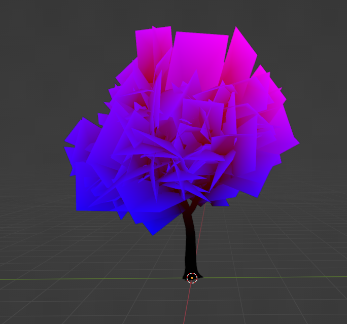

## Manual Import of Models
:::info
Some knowledge about Source 1 models will help with the process.
:::

If the source model files are already sourced, then skip this step. If not, then the model files must first be sourced. If the model is a native CS:GO model, use an extractor tool such as [GCFscape](https://gamebanana.com/tools/26) to extract model files from `pak01_dir.vpk` found in the `csgo/ folder`.

As a side note, "model files" in this instance mean a combination of 4 files in total of the same name, where each builds up different model properties. Furthermore, source models from other games can have different numbers of files.

Next, decompile these models to obtain their `.smd` files, for example by using <Tool name="github" label="Crowbar" link="https://github.com/ZeqMacaw/Crowbar"/>. More information about how to use the tool is found on the [official guide](https://steamcommunity.com/sharedfiles/filedetails/?id=791755353).

From Crowbar, we only need to obtain specific `.smd` files. Which `.smd` files to extract depends on the prop and what is required; the list below shows the possible options. If unsure, run everything at default settings.
* All props - only reference mesh SMD file (This is the actual model)
* Props that have collisions - physics mesh SMD file (This is the collision model)
* Props that have animations - bone animation SMD file (This stores model animations)

If successful, the tool outputs some `.smd` files. Move these into the <Game name="cs2"/> addons folder, keeping the same model directories as CS:GO. The directory of the model can be changed, but for consistency this is not recommended.

Open up [`ModelDoc`](/EngineTools/ModelDoc/) and create a new `.vmdl` file. Afterwards, [follow this guide from mapcore](https://www.mapcore.org/topic/24209-tutorial-import-a-model-and-its-material/) to import the decompiled `.smd` files into ModelDoc. Even though we use different import model files, the process of adding in imported model meshes in ModelDoc is still the same.

If all `.smd` are imported correctly, the model is now compilable. After compilation, check if all prop properties have been implemented correctly. If applicable, you can now add other properties to the prop and compile again.

## Adjusting CSM Properties
Editing CSM properties is by default disabled in `csgo.fgd`, and as such requires modifying the hammer `.fgd`.

First, search for the block for [`light_environment`](/Entities/light_environment.mdx). Afterwards, delete all the lines with `(remove_key)` in them.

Editing the CSM layer distance is a bit of a give and take; higher distance will increase the reach of the cascade layer at the cost of resolution. A good starting distance values are 1024, 512, 256, and 128 for cascade layers 1, 2, 3, and 4 respectively.

## Adding Tree Sways on Foliage Props
This requires use of blender (with a vertex coloring addon, such as *Vertex Color Master for Blender*, or any modeling software) to change the vertex colors on foliage meshes. 

When applying colors to the meshes, red should be used for the general sway of the tree, and blue should be used for individual flutters of leaves. First, apply a gradient from black to red from the bottom to the top of the foliage; darker colors represent less sway. Afterwards, apply blue to the edges of each branches/stems of the foliage mesh

In the end the base of the branches should have a red hue, whilst the end of branches should be blue - refer to the image below.

*Example vertex coloring on a tree foliage model.*

## Creating CS2-compatible .svg
It is possible that some `.svg`’s do not display properly in the loading screen. To briefly describe the problem, the paths (i.e. the shapes) in `.svg` files can be defined in absolute or relative coordinates. If the `.svg` is written in relative coordinates, only the first layer will be displayed in <Game name="cs2"/>; it is presumed that the `.svg` interpreter in <Game name="cs2"/> does not support translating the relative coordinates over the multiple layers.

:::info
More technical explanation can be found [here](https://www.w3schools.com/graphics/svg_path.asp).
:::

With a `.svg` vector editor, the fix is pretty simple. Simply set the preferences of the editor to use absolute coordinates, move the layers a bit so that the `.svg` can be saved, and it should be fixed immediately in <Game name="cs2"/>.

Without an editor available, then it is recommended to use [this png to svg converter](https://www.pngtosvg.com/). This will reduce the quality of the map icon, but this is not perceivable on the loading screen itself.