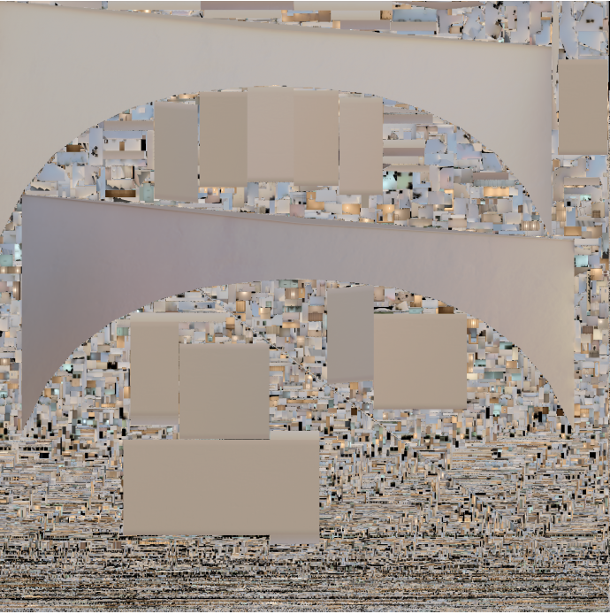

As <Game name="cs2"/> modding matures more and more, many useful tools and programs have been created to aid mappers (and porters alike). This guide will briefly cover the highlights of some <Game name="cs2"/> tools, although this guide will not do justice in showcasing the full capabilities of the tools that are introduced here.

## <Tool name="s2v"/>
<Tool name="s2v"/> is an extremely powerful tool that will accompany in all mapping and porting projects. When compared to S1 tools, it is essentially a combination of BSPSource (decompiling for .vmap and embedded assets), GCFScape (view and extract within a .vpk file), VIDE (view entity lump information), and more.

Here are some instances <Tool name="s2v"/> can be used when porting:
* Decompiling and extracting assets from <Game name="cs2"/> game files (`pak_dir.vpk` found in `game/csgo/`) and custom workshop maps. `.vpk` for workshop maps can be found in `Steam/steamapps/workshop/content/730/<workshop_id>/` and the workshop id can be found in the URL of the map’s Steam Workshop page.
* View the embedded assets and preview the map within the tool.
* Look at `irradiance.vtex_c` of a map (found under `maps/lightmaps/`) and fix any exceptional lightmap usages.

*Irradiance of de_mirage in the closed beta before the lightmap was optimized. Notice how a few meshes takes up a good chunk of the lightmap, which reduces the available lightmap space for the rest of the map. (source: message from @Angel in S2ZE discord)*
* View folder ordering within a compiled map, such as looking at the folder ordering and the required name formatting of the images used for loading screen background images.

## <Tool name="github" label="CS2Fixes" link="https://github.com/Source2ZE/CS2Fixes"/>
Although CS2Fixes mainly acts as the fundamental plugin to run Zombie Escape servers, it offers many features that porters can use. Detailed documentation for mappers can be found on the github page.

:::note
Although tempting, these mapping features should not be depended upon when creating new maps. These features are only implemented to be a community fix for many features that <Game name="cs2"/> does not support.
:::

### Setting up CS2Fixes Offline in Tools Mode
:::todo
Update this section
:::
