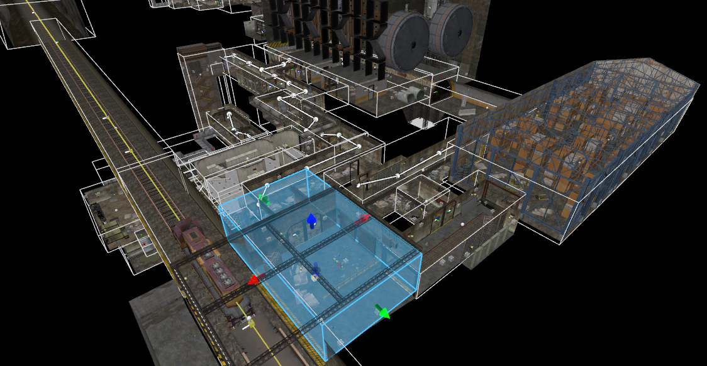
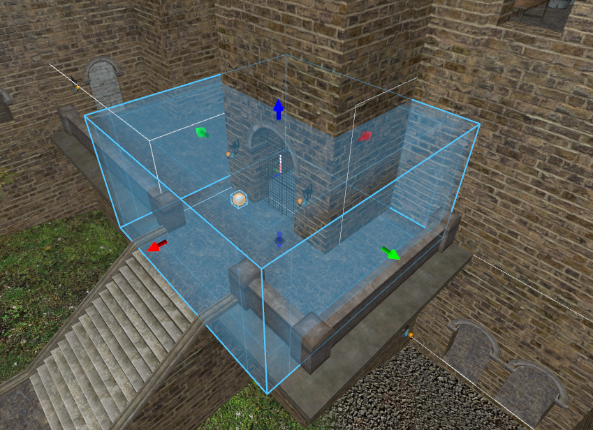
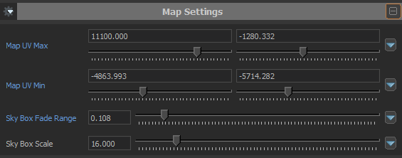
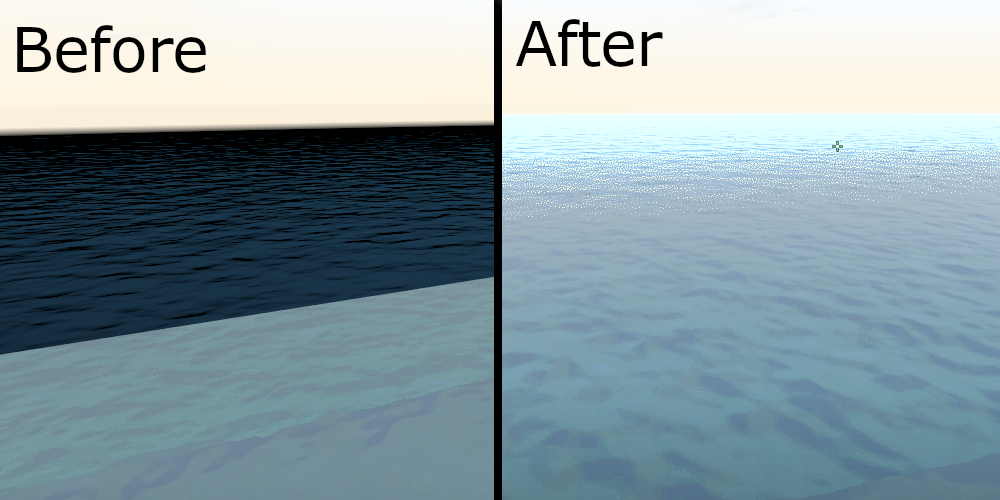
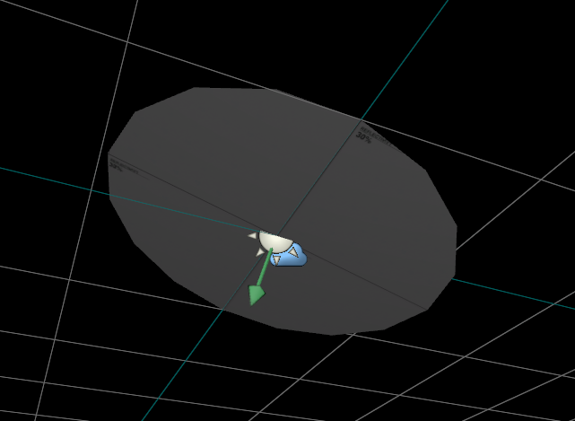

## Cubemap & Light Probe
In Source 2, a new entity [`env_combined_light_probe_volume`](/Entities/env_combined_light_probe_volume.mdx) calculates light probes for object lighting and builds cubemap textures within a single volume. This entity is mandatory to give lightning to props, player models, and view models (aside from dynamic light sources).

Normally, maps imported by the import tool have few of these entities placed in the map. However, the placements made by the import tool are not optimal, so it is much preferred to place these entities by yourself from scratch.

The placement is similar to how a `env_cubemap` is placed in Source 1. The white spheric gizmo is placed in an open space about 64 units above the floor, which is roughly the player's eye height in <Game name="cs2"/>. The volume of [`env_combined_light_probe_volume`](/Entities/env_combined_light_probe_volume.mdx) is adjusted by moving the arrow gizmos on each axis. It does not have to follow the exact geometry of the enclosing areas, but do make sure the volume completely covers the enclosing areas.

*An example from ze_tkara. The white outlines show the boundaries of each volume. The blue box is a selected volume, where the dimensions of the volume can be adjusted in each axis.*

As a general rule of thumb, at least one [`env_combined_light_probe_volume`](/Entities/env_combined_light_probe_volume.mdx) should be placed in every unique room, hallway, area, etc. Do note that cubemaps can take most of the map file size, so try to be conservative with its usage.

:::info
Make sure to build your cubemaps at least once. Otherwise, any textures with specular indirect enabled (i.e. cubemaps) will show purple-hint and can crash the map!
:::

If you want to just have either a cubemap or a light probe, use [`env_cubemap_box`](/Entities/env_cubemap_box.mdx) or [`env_light_probe_volume`](/docs/Entities/env_light_probe_volume.mdx) respectively.

### Cubemap Blends
Unlike `env_cubemap` in Source 1, cubemaps in Source 2 can be blended allowing for smooth transitions. This is most noticeable on a player's viewmodel and on shiny surfaces.

The extent of the blend is changed with **Edge Fade Dist**, where each input box represents each dimensional axis. Higher values extend the blend further into the cubemap volume. Here is a section within [Valve's wiki](https://developer.valvesoftware.com/wiki/Source_2/Docs/Level_Design/Post_Import_Fixup_steps#Cubemap_Blending) explaining more about cubemap blends.

*A screenshot from ze_hidden_fortress, showing the blended edges as mentioned above.*

:::warning
Overlapping multiple cubemap blends can be very expensive. Use cubemap blending only along edges where a blend is necessary, and try not to overlap more than 3 cubemap blends.
:::

### Changing Cubemap Resolution
As mentioned earlier, cubemaps can greatly bloat the map file size. This can be alleviated by reducing the cubemap resolutions.

To reduce the resolution, go to `gameinfo.gi` found in `csgo_core/` directory. Search for **EnvironmentMapFaceSize** within the file, and replace the value with the desired. Note that this must be in powers of 2; for reference, the default value is 256.

:::note
Changing the resolution may result in roughness on various textures to be displayed incorrectly. This also affects textures in official Valve maps as well, however, this only affects your game.
:::

## Water
In <Game name="cs2"/>, water is configured using the mesh entity [`func_water`](/Entities/func_water.mdx). Texturing still works the same; only the top face is textured with water and the rest of the faces must be *NODRAW*.

### Skybox Water Transition
Making a smooth transition between the main map and the skybox on a large body of water (e.g. to create a perception of 'infinite water') works differently in Source 2. In short, we will be making use of cubemaps, and changing the properties of the water texture.

First, increase the water mesh in the main map by about 512 units outwards into desired directions to match the skybox. For example, if the map is completely surrounded by water then extend the water mesh into all four cardinal directions. The amount of units to extend is arbitrary - the deeper the extension the more gradual the transition at the cost of greater map size.

Next, place at least one [`env_combined_light_probe_volume`](/Entities/env_combined_light_probe_volume.mdx) above the body of water in the skybox. This is to ensure that the skybox fade has a proper reference. Make sure that this light probe volume is near the water mesh in the skybox.

Finally, edit the water texture properties in the [Material Editor](/EngineTools/MaterialEditor/); if using a default water texture, make a copy by decompiling the game files. Under 'Map Settings', change the values of **Map UV Min** and **Map UV Max**; these are the minimum and maximum coordinates (in x and y coordinates) of the water mesh in the main map. When in doubt, you can set these coordinates to some extreme values.

*Example configuration of the water texture Map Settings properties*

Afterwards, adjust the other settings until the water transitions seamlessly between the main map and the skybox.

*Before and after comparison shots in ze_voodoo_islands. Some granularity in the transition may be present due to how transparency works in Source 2.*

If multiple water transitions are needed, then duplicate the water texture and repeat the process for each instance.

## Skybox
### Skybox Clipping
In Source 2, skybox textures are no longer solid, meaning players (and other objects) can fall out of the map through any skybox faces. Unfortunately, this requires fixing in Zombie Escape maps which are often prone to knockback boosts.

Fortunately, the fix is rather easy by adding player clips to all skybox faces. Select all skybox faces in face mode, duplicate them, and change the duplicate faces to a *CLIP* texture.

### Recreating `env_sun`
With the removal of `env_sun`, the sun has to be replaced by a mesh placed inside the map.

:::tip
It is recommended to create the sun mesh in the skybox due to its larger scales. Thus, the skybox is better at recreating the far perceived distance of the Sun.
:::

First, create a circular mesh and move it to [`light_environment`](/Entities/light_environment.mdx). Then, copy the angles from [`light_environment`](/Entities/light_environment.mdx) and apply it to the mesh. At this point the mesh is rotated 90° off from the desired angles.

Switch to local coordinates, and rotate the mesh until the arrow from [`light_environment`](/Entities/light_environment.mdx) is perpendicular to the mesh. If done correctly, the orientation between the [`light_environment`](/Entities/light_environment.mdx) and the mesh should look like the screenshot below.

*The desired orientation between [`light_environment`](/Entities/light_environment.mdx) and the mesh.*

Afterwards, drag the mesh to the very edge of the skybox. Replace the mesh texture to a suitable material; materials that includes the word ‘sun’ are often a good choice.

:::tip
You should experiment with different materials, having multiple stacked meshes, and changing the scale of the meshes.
:::

:::warning
Although it is possible to have these meshes beyond the hammer grid, it is recommended to have them within. Some transparent materials placed beyond the grid (to recreate the sun glare for example) may not display properly.
:::