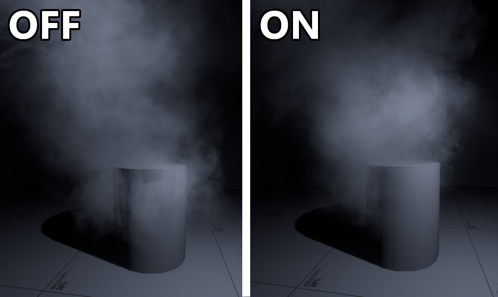
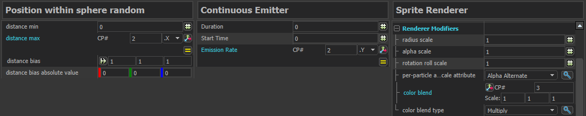
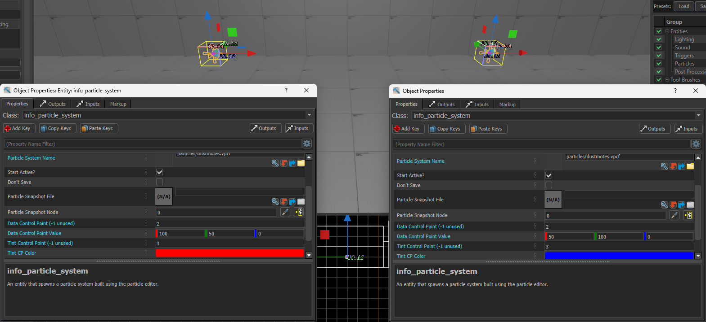
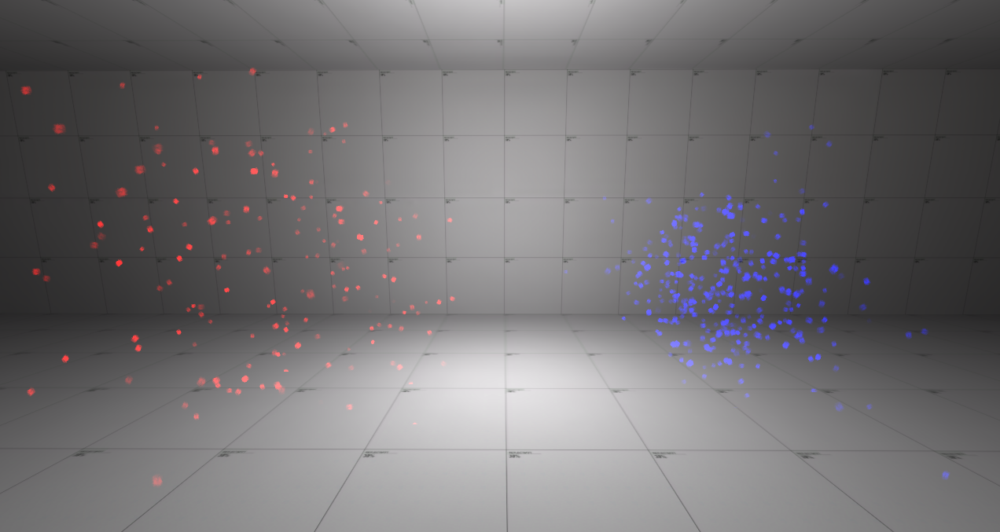

## Patching the Particle Editor
Although the [Particle Editor](/EngineTools/ParticleEditor/) is included in <Game name="cs2"/> tools since the limited beta, it is locked away for an unknown reason. Fortunately, it can be unlocked by [modifying your game files](/EngineTools/ParticleEditor#info).

:::tip
Particle Editor itself requires a whole new guide of its own. For tutorials using the Particle Editor, [this video of the Source 1 particle editor](https://youtu.be/70GhO6z5aKM?si=DO1S00dz365KZSQq) may be a good starting point. The new particle editor has more features in comparison, but those features are not properly documented.
:::

## Particle Rendering
Particles and particle systems remain relatively the same as in CS:GO. However, particles in <Game name="cs2"/> make use of OIT (order-independent transparency) sorting, which unfortunately causes heavy performance drops.

Fortunately, changing particle’s rendering method in the Particle Editor can greatly improve performance for a little to no impact to the visuals.

For now, there are four distinctive configurations that you can have on a particle:
* Default (i.e. no rendering settings enabled): the default configuration of particles in <Game name="cs2"/>. It is the most heavy on performance.
* Game overlay pass (enable **Only Render in effects game overlay pass**): provides the maximum uplift to performance. Unfortunately, this renders particles in front of smoke (from the smoke grenade), and does not support depth feathering (explanation below).
* Mixed resolution rendering (enable **Use Mixed Resolution Rendering**): provides a medium uplift to performance, somewhere in between default and game overlay pass. Does render correctly through smoke, and supports depth feathering.
* Bloom pass (enable **Only Render in effects bloom pass**): also provides the maximum uplift to performance, and unlike the default settings, it can properly display through smoke and supports depth feathering. Unfortunately, it is unsuitable for darker colored sprites due to the bloom effect.

:::info
The following image shows the difference from depth feathering; they essentially enable particles to blend more naturally with world geometries.

*Showing the difference between depth feathering disabled and enabled on a particle.*
:::

For Zombie Escape, it is extremely unlikely that a smoke grenade will ever be used. Thus, almost all particles should make use of game overlay pass if depth feathering is not an issue. Otherwise, you should prioritise using bloom pass or mixed resolution rendering if the particle also happens to be dark. For other game modes, using mixed resolution rendering is recommended.

:::note
Modifying particles via the Particle Editor can only be done on custom particles. Native <Game name="cs2"/> particles are not modifiable, unless they have been extracted using <Tool name="s2v"/>.
:::

## Importing Particles
The import tool does not import particles. For now, there are a couple of alternative methods:
* Replace particles with ones provided in base <Game name="cs2"/>. Be aware that some particles may not work as intended.
* Use an older version of the import tool (not recommended), or use a third-party import tool such as <Tool name="github" label="kristiker's source1import" link="https://github.com/kristiker/source1import"/>. Note, you should still use Valve's import tool to port your map, and use this third-party tool to import particles only.
* Remake particles completely from scratch in the Particle Editor.

## Control Points
Control points offer a powerful method of manipulating particle properties of the same system. Although control points are not new with Source 2, they now have the ability to accept inputs from control points to modify the particle system, such as their spawn rates or colors.

The following example below is our recreation of `func_dustmotes` as a particle. This particle has the initializer of ‘Position within sphere random’, emitter of ‘Continuous emitter’, and renderer of ‘Sprite renderer’. In the Particle Editor, we are able to modify some properties of the particle to take in values from a control point.

*In this example, the x-axis of CP #2 controls the radius of particle generation, y-axis of CP #2 controls how many particles are generated per second, and CP #3 allows tinting of particle colors.*

Using [`info_particle_system`](/Entities/info_particle_system.mdx) in this instance, we are able to define and give corresponding control point values. Note, how the same particle system has been used in both info_particle_system.

*We input the control points and the corresponding values to customize the same particle with different properties.*

After a quick compilation, we are able to see the clear differences between these two systems as shown in the screenshot below:

*Two different particles using the same system.*

Naturally, these are not the only properties that can accept control points, which further highlights their potential.

### Precipitation
As mentioned previously in the section about [missing entities in Source 2](./s1_ents.md#missing-entities), many `func` entities that use particles are widely no longer supported in <Game name="cs2"/>. However, a member of our team *EasterLee* has created <Tool name="github" label="prefabs of many particle systems" link="https://github.com/EasterLee/easter_prefabs"/> to replace the missing entities, similar to the replacement done for `func_dustmotes` above.

  
  

*Example use of rain particle prefab and its modification for snow in our ports.*