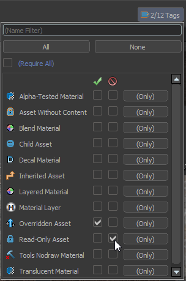

## Nav
An improperly built nav mesh can greatly lag a server, especially at a higher player count and or in a spacious map. As both conditions are true in the majority of Zombie Escape maps, it is recommend to not compile a nav mesh at all; having a nav mesh does not make a difference on a live server.

:::note
Unlike Source 1, .nav is not generated automatically. In <Game name="cs2"/> maps without .nav can be launched, but no bots can be spawned.
:::

## File Size Optimizaiton
<Game name="cs2"/> does not have any size limitation to a map upload (in contrast to the 150 mb limit for CS:GO FastDL), except for a 2 GB size limit when uploading to the workshop. In any case, it is highly recommended to compress the map size as much as reasonably possible, for example to help players with slower internet speeds.

Potential methods include [reducing the cubemap resolution](./env_fix.md#changing-cubemap-resolution) and [removing .los files before uploading to workshop](./steam_workshop.md#packed-assets), but if applicable, the file size can be reduced even more.

### Lightmap resolution
Choose the lightmap scale (512, 1k, 2k, etc.) appropriate for the size and complexity of a map. The higher the lightmap resolution, the more space it will take up. A simple map with only a couple of rooms would not need a 8k lightmap!

### Bake lightning on props
By default, lightning on props are baked onto the lightmap. Not only does this occupy a section of the lightmap which can be used on world meshes, it also increases the map size.

By disabling **Baked Lightning** on props, the prop will instead be forced to use lightning using light probes. This results in slightly worse lightning, but in most of the cases it will be 'good enough' that most players will not notice during gameplay. 

:::tip
Disabling **Baked Lightning** is most beneficial for props that have large textures, for example with foliage models.
:::

### Audio Quality
This method was more prominent in S1, but still is applicable in S2. When possible, try to reduce the bitrate of a sound file to a cheaper but acceptable quality. This does not need to be taken to the extreme (like in many *Hannibal*’s maps), but try to avoid using many high-quality music files.

In reality, it is more likely to encounter the opposite when porting CS:GO maps; many music files had to have lower quality music to meet with the file size limit. In this case, try to source the music and redownload them at a higher quality.

### Steam Audio
Since the Arms Race update, a new option has been added to the compile menu under 'Steam Audio'. This will enhance the quality of audio within the map, at the cost of extra file size.

Naturally, this feature is completely unnecessary for Zombie Escape maps and should not be used. Zombie Escape maps are usually busy in audio, especially with the map music. Most importantly however, Zombie Escape is a casual gamemode where having good map audio quality is not necessary, and most players will not notice the difference.

### Replacing Assets
#### Textures
To reduce the map filesize, try to replace as much of the ported textures to native <Game name="cs2"/> textures. On top of reduced filesize, the new <Game name="cs2"/> textures make use of new PBR features and as such are at a much higher quality. Replacing textures can be done by finding similar substitutions, unless the texture is extremely iconic and is truly unreplaceable.

In most instances, imported textures may already have their equivalent native textures. These textures can be seen in the Asset Browser by filtering for the Overridden Asset and Read-Only Asset tags, as seen below:

If a replacement texture can be sourced, then simply select all faces using the imported texture, and replace the faces with the new texture. After all relevant textures are replaced, make sure the imported texture and its compile is properly deleted from the addon using the [Asset Browser](/EngineTools/AssetBrowser/getting-started.md).

:::warning
Reverting texture deletion from the Asset Browser is rather difficult, so it is preferable to delete the duplicate textures only after all relevant textures are replaced.
:::

#### Models
Similarly, it is recommended to replace models to <Game name="cs2"/> equivalence; it is very likely that the imported models from CS:GO are at a lower quality than the native <Game name="cs2"/> models. As such, you can use the same filters as above to look for any duplicate models in your addon. Naturally, the same exceptions apply - iconic models should ideally be kept.

All imported foliage models, however, will lose support for [`env_wind`](/Entities/env_wind.mdx) sways. Ideally, these should be all replaced by <Game name="cs2"/> foliage models. Note that not all <Game name="cs2"/> foliage models support [`env_wind`](/Entities/env_wind.mdx) sways.

:::note
If you cannot find a suitable replacement for foliage models, tree sway support can be [added manually to the imported model](../ExploitingS2/advanced.md#adding-tree-sways-on-foliage-props). Be aware that this requires the use of Blender.
:::

## Movements
This section will veer a bit off from Zombie Escape and discuss elements from other movement-based community gamemodes.
### Surf Ramps
Ramp bugs (where players seemingly "lose all momentum" on surf ramps) are much more prominent in <Game name="cs2"/>. This of course defeats the purpose of the surf gamemode and can make a ZE map be unplayable. This gets progressively worse on ramps with bad mesh geometry, such as ones generated from the import tool.

With a little preparation before using the import tool the frequency of ramp bugs can be greatly reduced. This is done by converting surf ramps temporarily into [`func_brush`](/Entities/func_brush.mdx), so that their S1 geometry remains unchanged during map import.

:::info
For additional guide regarding ramp bugs, refer to the [dedicated section](https://docs.google.com/document/d/1NPyS_otVjCePwLod-aqHQaogOvjme0Rr4YHd1BFccrI/edit?tab=t.0#heading=h.lzrul7hkjtcw) from S2 Surf Map Porting Guide together with the [Mapping Guide](https://github.com/Chent-AU/CS2-Surf-Mapping#ramp-bugs) by Chent.
:::
