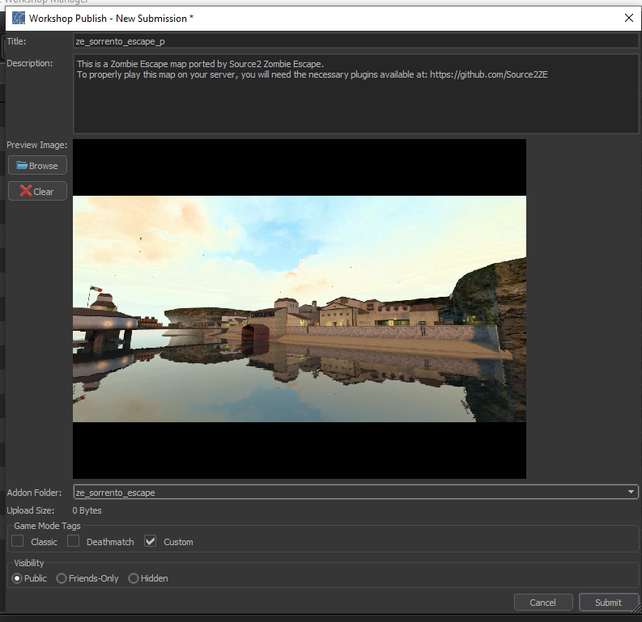

With the release of the Workshop for <Game name="cs2"/>, packing the map and sharing with other players have become easier.

For most Zombie Escape mappers, however, this will likely be their first time using the Steam Workshop. Whatever your familiarity with the Workshop may be, this section will introduce how to upload maps to the Workshop and explain which assets are automatically packed.

## Packed Assets
When uploading a map addon to the workshop, `gameinfo.gi`, which is located in `game/csgo/`, will dictate which paths within your addon game folder are whitelisted; i.e. which paths will be automatically packed into your map.

In the default configuration, files in these directories are packed (i.e. "include"):
```
maps
cfg/maps
materials
models
panorama/images/overheadmaps
particles
resource/overviews
scripts/vscripts
sounds
soundevents
lighting/postprocessing
postprocess
addoninfo.txt
```
Files in these directories are not packed (i.e. "exclude"):
```
maps/content_examples
```

Although the default whitelist list is pretty comprehensive, it does miss out on a couple of paths that may improve the quality of the map. For example, the current default configuration does not pack files required for the [loading screen](../ExploitingS2/loading.md).

However, this list is not definitive and can be changed as needed. Carrying on the example of loading screen files, changing `panorama/images/overheadmaps` into `panorama` will then pack the relevant files. Do note that all paths have to be relative to the `game` folder of your addon.

## Uploading to the Steam Workshop
The Steam Workshop is streamlined and easy to use; all that needs to be done is to upload the map, and the distribution of files are done automatically by the workshop.

In the asset browser, look for [Counter-Strike 2 Workshop Manager](/EngineTools/WorkshopManager). If the manager pops up, create a New Submission to upload the addon. After the pop up page for a submission opens up, select the addon to upload and give some descriptions about the map. The submission can be edited later, so not all details need to be written down yet.


*Example submission of ze_sorrento_escape_p*

Some notes about each field:
* Preview Image: This is the image everybody will see when browsing through the Workshop, and the first image that is shown on the map workshop page. More images can be added after the submission is uploaded.
* Upload Size: This will display the contents of the map and their respective sizes.
* Game Mode Tags: This is mainly for the search filter on the workshop browser, but it is recommended to set this as 'Custom' for completeness.
* Visibility: This will obviously depend on the original mapper’s and the porter’s intentions, but 'Public' is the recommended option here.

Afterwards, a steam moderator will then review the submission. This can take any time between a few minutes to a day. During this review period the visibility of the submission is automatically set to 'Hidden', so other people with the link to the submission will not be able to view or subscribe to the submission.

:::info
Any edits that you make to your submission will require another review. This includes minor things such as changing the description or adding a few more images. However, multiple edits can be made during a review period.
:::

:::note
The steam workshop moderation is actually fairly lenient, provided that you follow [Steam's rules and guidelines](https://help.steampowered.com/en/faqs/view/6862-8119-C23E-EA7B).
:::

Assuming things go well, you are done! The submission would have passed the review and the visibility will be set back to whichever chosen when submitting.

## Notes about the Steam Workshop
Here are some key differences between the old distribution method (FastDL) and the Steam workshop. Often not these are beyond a mapper’s control, but nonetheless it is important to be aware of them.
* Version control: The uploader of a submission will have access to revert to a previous version of the submission. This is useful when the updated map has a major bug that affects the playability of the map. However, this feature is only given to the uploader, and as such is limited. Be very careful whenever reverting to an older version as this affects all players and servers subscribed to the submission.
* Server contents: With the possibility of <Tool name="github" label="multi-addons loading" link="https://github.com/Source2ZE/MultiAddonManager"/> on a server, servers can now load maps alongside their own asset addon. However, server owners can still choose to create their own modified map addon, for example for a stricter version control or for censorship.
* Map vs. Addon: When uploading a submission to the workshop, the entire addon is uploaded. If an addon has multiple maps that share the same assets, then theoretically they will all be uploaded into one addon. The practicality of this has not been experimented yet, so for now avoid doing this.
* Dependencies: As Zombie Escape development matures, expect a return of various quality of life plugins. If assuming a similar architecture to CS:GO, then any dependent config files will have to be distributed by other means, likely using third-party file distributors (i.e. like how it was in CS:GO).
* Uniqueness: Since each workshop submission is given an unique ID, it is now possible to have multiple maps of the same name. This should generally be avoided for the reason of future proofing.