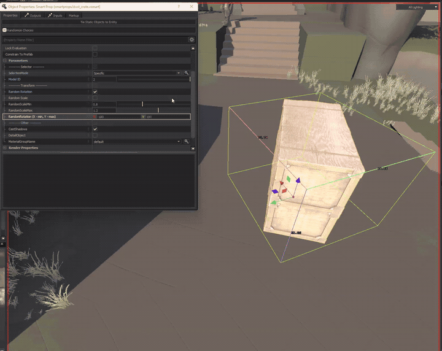
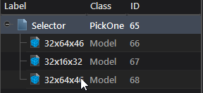
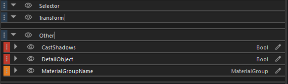
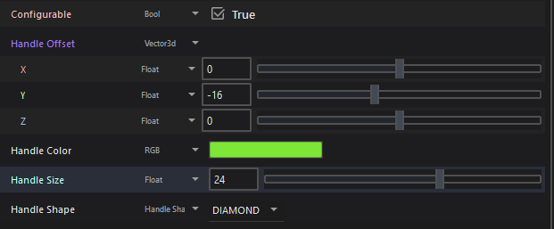
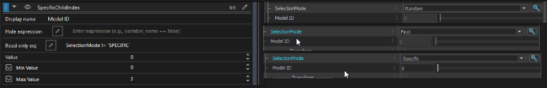
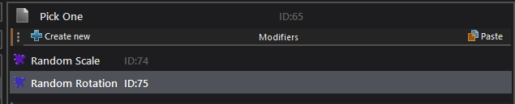
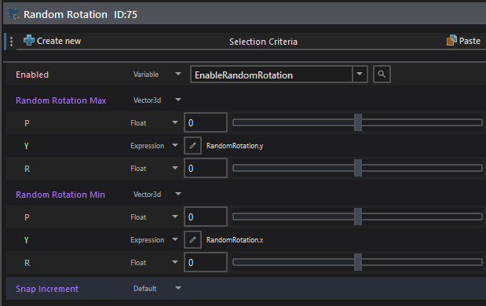

This tutorial builds a crate selector containing multiple Dust 2 crate models. It supports manual selection through a slider, automatic randomization, optional random scaling, and horizontal spin rotation.



 [Download dust_crate.vsmart](/downloads/hammer5tools/vsmart-examples/dust_crate.vsmart)

:::note
This guide builds on the fundamentals in the [SmartProps guide](../index.mdx). Start there when working with SmartProps for the first time.
:::

## Create the root PickOne element
In the Hierarchy window, right-click and add a new element of type PickOne.

## Add model elements
Add several Model elements as children under the PickOne element.
Toggle Dynamic Isolation in the toolbar to isolate and inspect the active model being positioned.


## Name the elements
Double-click each model element in the hierarchy and give them clear, descriptive labels.



## Expose model properties
Select a model element and expose useful properties as variables, such as Material Group, Cast Shadows, and Detail Object.
Remember to specify the model path for material group variables so Hammer knows which skins are available.


## Organize with categories
Create variable categories in the Variables panel to keep the parameters neatly grouped in Hammer's Object Properties.



## Configure the viewport handle
Select the root PickOne element. In the property editor, configure the handle color, shape, and offset position. Offsetting the control handle ensures it does not overlap with Hammer's standard translation gizmo.




The control handle will now appear cleanly next to the prop in the viewport:


## Create the selection switcher
Add a toggle that switches between random selection and manual slider selection.
In the Variables panel, expose:
- `SelectionMode` (bound to the PickOne selection mode property)
- `SpecificChildIndex` (bound to the specific child index property)

## Set the index range
Set the Min and Max bounds for the `SpecificChildIndex` variable. For 3 child models, set Min = 0 and Max = 2 (since index 0 is the first model).

## Disable the slider conditionally
The slider should be active only when `SelectionMode` is set to `SPECIFIC`.
In the `SpecificChildIndex` variable settings, set the Read-only Expression to:
```text
SelectionMode != 'SPECIFIC'
```



The selection logic is configured.

## Add randomization modifiers
To add variation, attach Random Scale and Random Rotation modifiers to the root element.



## Add randomization toggles
Create two boolean variables to let mappers turn randomization on or off:
- `EnableRandomScale` (default: false)
- `EnableRandomRotation` (default: false)


## Expose scale parameters
Expose the Min Scale and Max Scale properties in the Random Scale modifier, and bind its Enabled property to `EnableRandomScale`.


## Create a Vector2D variable for rotation
Rotation requires only the Z, or spin, axis. Create one Vector2D variable instead of separate minimum and maximum float variables:
- `X` = Minimum spin angle
- `Y` = Maximum spinangle


## Split vector expressions
In the Random Rotation modifier, switch the Z min and max rotation fields to Expression mode. Use expressions to reference the split components:
- Min Z Rotation: `RotationRange.x`
- Max Z Rotation: `RotationRange.y`



:::tip
Drag horizontally with the mouse wheel over numeric input fields in Hammer Editor to adjust values smoothly.
:::


Save the SmartProp and place it in a <Game name="cs2"/> map.
