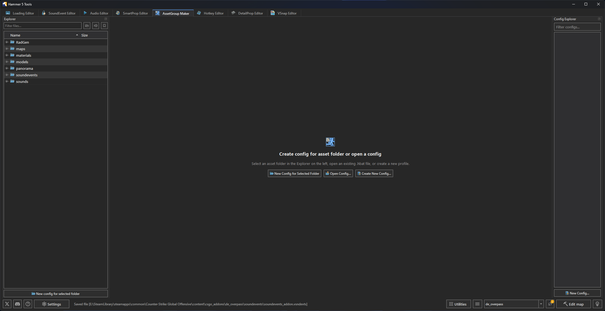
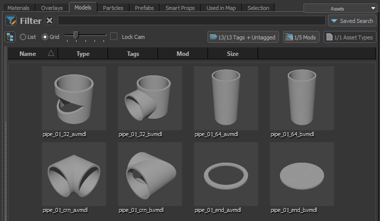
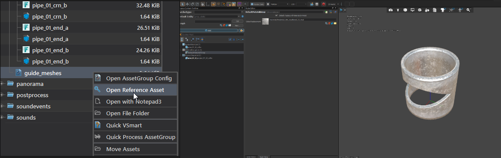
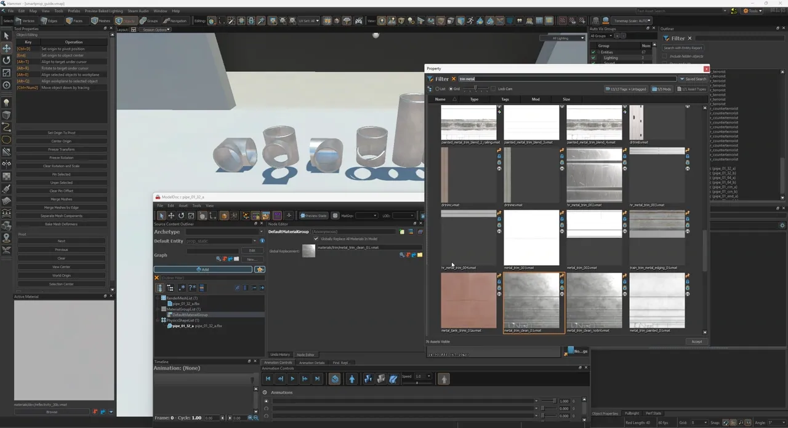

AssetGroup Maker creates a set of Source 2 assets from files in one folder. Each `.hbat` profile stores the input rules, templates, replacements, and output directory.

## Create or open a profile

Select a folder in Explorer and click New Config for Selected Folder. Use Create New Config... when the profile belongs somewhere else. Use Open Config... to open an existing `.hbat` file.

Each profile opens in its own tab. Use `Ctrl+S` or Save to save the current profile.

## Templates

Select a reference asset through Asset Browser... or Browse.... Click the adjacent <Game name="cs2"/> button to open the reference in its Source 2 editor.

Click + Add Template to create more than one output for each input asset. Templates can create VMDL, VMAT, VSMART, and other text assets supported by the processor.

Click Edit Slot Mappings... to map companion files and replacement tokens. For an FBX template, click Research FBX Materials to read its material slots. Map each source slot to a VMAT or add a remap with + Add Remap.

Use Exclude (Blacklist) to skip matching extensions and file names. Use Include (Whitelist) to process only the listed extensions and files. Global filters apply to every template in the profile.

## Review assets

The asset table shows each input, its selected template, detected slots, target output, and processing status. Use Search, Status, and Template to filter the table.

Right-click an asset to choose Show in Explorer, Open in <Game name="cs2"/> Tools, Copy Asset Name, or Copy Output Path.

## Process a batch

Set Output Directory when generated files belong outside the input folder. Click Process Batch and review the reported asset count.

Click Revert Batch to delete files created by the last process. Reference templates are kept.

## Batch import a mesh kit

AssetGroup Maker batch-generates and synchronizes models instead of requiring manual configuration of each `.vmdl` file in Hammer.

1. Launch the <Game name="cs2"/> tools through <Tool name="hammer5tools"/> so the console command pipe is connected. See [FAQ and troubleshooting](../faq.mdx#console-features-do-not-connect) when launching them from Steam instead.
2. Place the source FBX files in the addon's content directory, such as `content/csgo_addons/<addon>/models/pipe_kit/`.

   

3. Select the FBX files in Explorer, right-click, and choose Quick create vmdl.
4. Select the created model and click Quick AssetGroup file to generate the `.hbat` configuration.
5. Select the `.hbat` file and click Quick process AssetGroup.

   

6. The `.vmdl` source files are now generated. Compile them in the <Game name="cs2"/> tools before use:

   

7. Right-click the `.hbat` file and choose Open Reference Asset. Review the generated models after changing collision hulls, physics, or material assignments:

   

   

:::tip
Check the generated files after changing a reference asset.
:::

The [Modular pipes with FitOnLine](../../../CommunityGuides/fitOnLine/index.mdx) guide uses this workflow to build a pipe kit.

## Monitoring

Enable Watch the changes to watch the profile's input files. A changed input is processed again with the saved profile.

Use Settings > AssetGroupMaker > Folders to monitor to control which folders can be watched. Restart <Tool name="hammer5tools"/> after changing that list.
