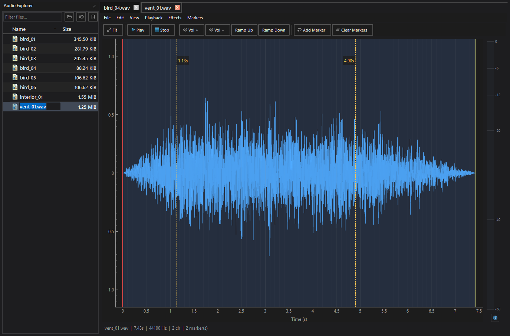

The Audio Editor displays waveforms and edits audio files from the active addon's `sounds` directory.

## Files

The editor supports WAV audio and imports `.mp3`, `.flac`, `.aac`, `.m4a`, `.ogg`, and `.wma` files for editing. Saving writes WAV data; use the SoundEvent Editor to reference the saved audio in a sound event.

Click New to create an empty document. Click Open or drop an audio file onto the editor to load it. Use Save or Save As to write a WAV file.

## Interface

| Area | Purpose |
|---|---|
| Audio Explorer | Browse audio files in the active addon's `sounds` directory. Double-click a file to open it. |
| Waveform | View and select audio samples. |
| Toolbar | Playback, marker, zoom, and audio-operation controls. |

## Editing

Select a section of the waveform, then use the available controls to apply Vol +, Vol −, Ramp Up, or Ramp Down. The editor also supports undo and redo.

Drag across the waveform to select samples. Use Cut, Copy, Paste, and Select All to edit the selection. Use `Ctrl+Z` and `Ctrl+Y` to undo and redo edits.

Vol + raises the selected samples by 25 percent. Vol − lowers them by 20 percent. Ramp Up fades the selection in. Ramp Down fades it out.

## Playback and navigation

Click the waveform to move the playback position. Use Play/Pause or press `Space` to start and pause. Use Stop to return playback to the start.

Use Zoom In, Zoom Out, and Fit to change the waveform view. The vertical meter shows the current level. Open Show dB Level Reference Guide to read the level scale.

## Markers

Move the playback position and choose Add Marker or press `M`. Choose Clear Markers to remove all markers from the document.

Markers are stored in the saved WAV file.
