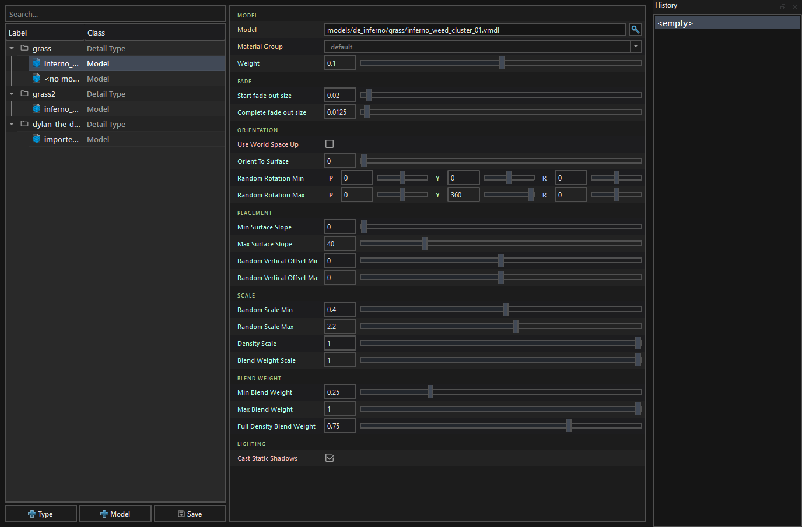

A visual editor for configuring Source 2 detail props in `scripts/detail_prop_types.vdata`.




## Overview

The editor reads and writes the addon's `scripts/detail_prop_types.vdata` file. Use the hierarchy to create detail types and model entries, then edit the selected item's fields in the property panel.


## Interface layout

| Area | Description |
|---|---|
| Hierarchy | Tree of detail types and their model entries. |
| Properties | Fields for the selected detail type or model. |
| History | Dockable undo history. |


## Data file

The editor reads and writes:

```
content/csgo_addons/<addon_name>/scripts/detail_prop_types.vdata
```


## Detail type properties

When a Detail Type node is selected, the editor exposes its density:

| Property | Type | Description |
|---|---|---|
| Density | Float | Number of props placed per square foot. |


## Model entry properties

Each detail type can contain multiple model variations. When a Model child node is selected, its fields are grouped as follows:

| Group | Fields |
|---|---|
| Model | Model resource, material group, and weight. |
| Fade | Start and complete fade-out sizes in screen-space units. |
| Orientation | World-space up, orient-to-surface amount, and random rotation min/max. |
| Placement | Minimum/maximum surface slope and random vertical offset. |
| Scale | Random scale, density scale, and blend-weight scale. |
| Blend Weight | Minimum, maximum, and full-density blend weights. |
| Lighting | Whether the model casts static shadows. |

The model's Weight determines its relative frequency within its detail type.


## Operations and shortcuts

| Action | Shortcut | Description |
|---|---|---|
| Type button / context menu | — | Adds a detail type after a name is provided. |
| Model button / context menu | — | Adds a model to the selected detail type. |
| Duplicate | `Ctrl+D` | Duplicates the selected hierarchy item. |
| Delete | `Delete` | Removes the selected hierarchy item. |
| Undo / Redo | `Ctrl+Z`; `Ctrl+Y` or `Ctrl+Shift+Z` | Reverses or reapplies changes. |
| Save | `Ctrl+S` | Writes `detail_prop_types.vdata`. |


## Use detail props in Hammer

1. Configure the detail types and assign the grass or clutter models in <Tool name="hammer5tools"/>.
2. Save with `Ctrl+S`.
3. In Hammer, open the Material Editor for the blend material (`.vmat`).
4. Open the Detail Props tab and select the detail prop types for the corresponding material layers.
5. In the Hammer viewport, enable Toggle Grass / Detail Props to display the detail props across the terrain.
