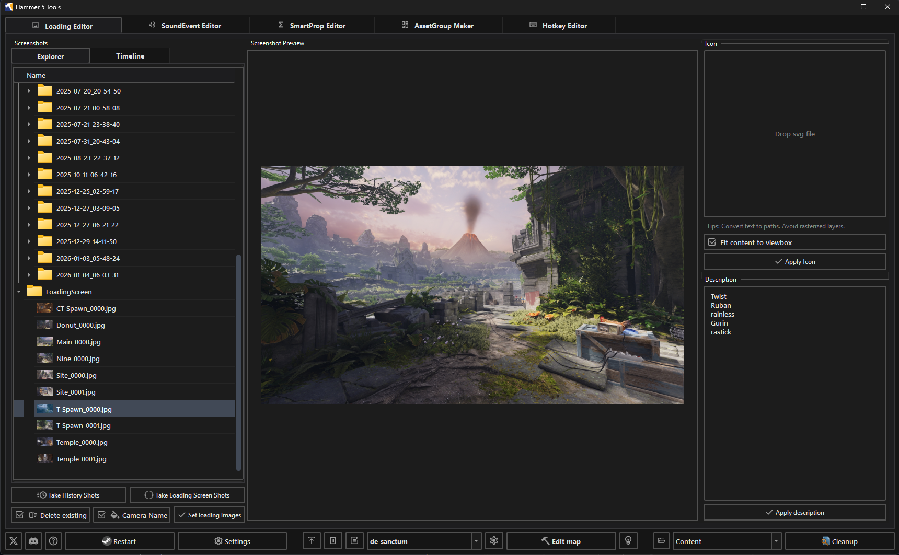

Loading Editor creates loading-screen images, animations, a map icon, and a map description for the active addon.

The editor reads the main map at `maps/<addon>.vmap`. Add `point_camera` entities to that map before taking screenshots.

## Screenshots

Click Take History Shots to capture dated screenshots from the map cameras. Click Take Loading Screen Shots to capture the set used by the loading screen.

Enable Camera Name to add each `point_camera` name to its image. Enable Delete existing to remove the current loading-screen images before writing the new set.

Review the images in the Explorer tab. Select an image to show it in the viewport. Right-click a folder or image to open its folder or remove it from the list.

Click Set loading images to write the selected screenshots to the addon's loading-screen data.

## Timeline

Open the Timeline tab to group history shots by camera and capture time. Click Refresh after creating or changing screenshots.

Select GIF, WEBP, or MP4, then select the output quality. Quality affects WEBP and MP4 output.

Click Create animation to create an animation for every camera. Right-click a camera to choose Export Animation..., Show in Viewport, or Open Containing Folder.

## Map icon

Drop an SVG into the Icon panel. Convert text to paths before importing the file.

Enable Fit content to viewbox to fit the SVG content into a 32 × 32 view box and remove hidden elements. Click Apply Icon to write the map icon.

## Description

Enter the loading-screen text in the Description panel. Click Apply description to write it for the active addon.

Open the map in <Game name="cs2"/> and check the images, icon, and description after applying them.
