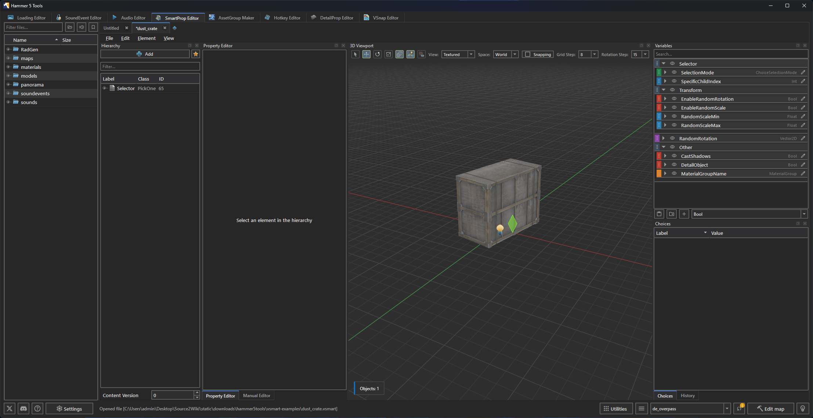
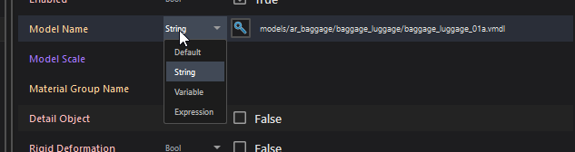
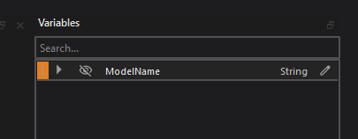
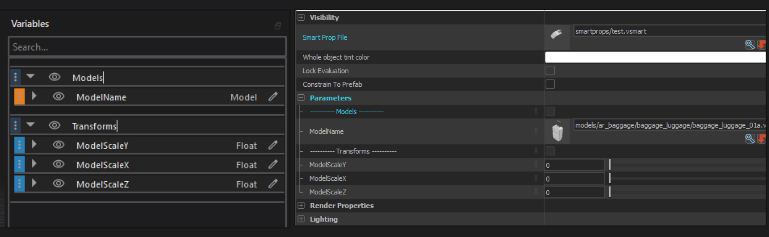

SmartProp Editor creates and edits Valve `.vsmart` and `.vdata` procedural prop files for <Game name="cs2"/>.

## Overview

SmartProps represent Source 2's procedural placement and asset variation system. A `.vsmart` file defines a hierarchical graph of elements (models, scatters, grids, deformable lines) altered by operators (transforms, traces, color tints) and controlled by user-facing variables.

The editor provides a hierarchy, property controls, variables, choices, history, and a 3D viewport.

The editor's compiler configuration applies only when <Game name="cs2"/> Hammer is launched through <Tool name="hammer5tools"/>.

For the SmartProp concepts behind these controls, see the [SmartProps guide](../../../CommunityGuides/smartProps/index.mdx). The [Modular pipes with FitOnLine](../../../CommunityGuides/fitOnLine/index.mdx) guide works through a complete procedural asset.

## Interface layout

The editor window is organized into docked workspaces:

| Panel | Description |
|---|---|
| Explorer Dock (Left) | File browser rooted at the active addon's content folder for quickly opening `.vsmart` and `.vdata` files. Features an enhanced Quick VSmart generator with support for variables, modifiers, and categories. |
| Document Tabs (Center Top) | Multi-document tab bar allowing multiple `.vsmart` files to be open concurrently. |
| Hierarchy Panel (Center Left) | Tree view representing the element graph (`CSmartPropElement_*` nodes). |
| Property Editor (Center Right) | Inspector for element properties, attached modifiers (operators/filters), and selection criteria. |
| Variables Panel | Exposes configurable parameters (Strings, Bools, Floats, Vectors, Colors, Materials, Angles) to Hammer users. |
| Choices Panel | Manages weighted variations when a `PickOne` element is selected. |

The Manual Editor dock edits the current document as text. The History dock lists undoable edits.

## Documents

Click Create New or press `Ctrl+N` to create a SmartProp. Click Open File or press `Ctrl+O` to open a `.vsmart` or `.vdata` file.

Use File > Save, Save As, or Save All to write changes. An asterisk on a document tab marks unsaved changes. Closing a changed document opens a save prompt.

Right-click a document tab to choose Save Current Layout as Default or Reset Layout.

## Hierarchy commands

Right-click the hierarchy to add an element or create one from a preset. The same menu provides Remove, Duplicate, Group selected, Copy, Cut, Paste, and Paste with replacement.

Paste with replacement opens Find and Replace before inserting the copied data. Use it when duplicated elements need a new model path, variable name, or category.

Use Bulk Model Importer to create model elements from several VMDL files. Use Load Vmap... to add supported VMAP objects to the hierarchy.

Select an element and choose Isolate in 3D viewport or press `Ctrl+H` to hide the other hierarchy branches from the preview.

## Docks and layout

Use View > Docks & Panels to show or hide Explorer, Hierarchy, Property
Editor, Variables, Choices, 3D Viewport, Manual Editor, and History.
Drag dock headers to rearrange them.

Choose Save Current Layout as Default after arranging the docks. Choose Reset Layout to restore the supplied layout.

## Element types

| Element | Valve Class | Description |
|---|---|---|
| Group | `CSmartPropElement_Group` | Organizational container for child elements. |
| ModifyState | `CSmartPropElement_ModifyState` | Transforms state without placing physical geometry. |
| SmartProp | `CSmartPropElement_SmartProp` | Sub-graph embedding another `.vsmart` file by reference. |
| Model | `CSmartPropElement_Model` | Places a static Source 2 `.vmdl` model. |
| ModelEntity | `CSmartPropElement_ModelEntity` | Places a model entity and exposes its model, material group, shadow, static, and deformable settings. |
| PropPhysics | `CSmartPropElement_PropPhysics` | Places a physics prop and exposes its model, material group, shadow, static, deformable, and start-asleep settings. |
| PropDynamic | `CSmartPropElement_PropDynamic` | Places an animated dynamic prop. |
| PlaceInSphere | `CSmartPropElement_PlaceInSphere` | Scatters instances across a spherical or planar disc volume. |
| PlaceMultiple | `CSmartPropElement_PlaceMultiple` | Repeats child elements a set number of times. |
| PlaceOnPath | `CSmartPropElement_PlaceOnPath` | Distributes children along a path with defined spacing. |
| FitOnLine | `CSmartPropElement_FitOnLine` | Scales and distributes elements between two endpoints. |
| PickOne | `CSmartPropElement_PickOne` | Selects one child from a weighted list of choices. |
| Grid | `CSmartPropElement_Layout2DGrid` | Arranges children in a 2D rectangular grid. |
| BendDeformer | `CSmartPropElement_BendDeformer` | Warps child geometry along an arc. |
| MidpointDeformer | `CSmartPropElement_MidpointDeformer` | Deforms children along a spline curve. |

## Modifiers, operators, and filters

Modifiers attach to elements in the Properties panel and execute sequentially from top to bottom.

Use the Create New button to add modifiers and selection criteria. Use the Paste button on the right side of the panel to paste copied modifiers. Standard shortcuts manage them:

| Action | Shortcut |
|---|---|
| Copy | `Ctrl + C` |
| Duplicate | `Ctrl + D` |
| Cut | `Ctrl + X` |
| Delete | `Del` |

### Common operators
- Transformations: `Rotate`, `RandomRotation`, `RandomRotationSnapped`, `ResetRotation`, `RotateTowards`, `SetOrientation`, `Translate`, `RandomOffset`, `SetPosition`, `Scale`, `RandomScale`, `ResetScale`.
- Materials & Appearance: `SetTintColor`, `MaterialOverride`, `MaterialTint`, `SetMaterialGroupChoice`.
- Traces & Raycasts: `TraceInDirection` (drops props onto floor/mesh), `TraceToPoint`, `TraceToLine`, `Trace`.
- Gizmo Handles: `CreateSizer` (box-scale handle), `CreateRotator` (angle handle), `CreateLocator` (position handle).
- Math & Vectors: `ComputeDotProduct3D`, `ComputeCrossProduct3D`, `ComputeDistance3D`, `ComputeNormalizedVector3D`, `ComputeVectorBetweenPoints3D`.
- State Management: `SaveState`, `RestoreState`, `SavePosition`, `SaveDirection`, `SaveScale`, `SetVariable`.

### Filters
Filters decide whether an element is evaluated or skipped:
- Probability: Spawns element with a random chance (0.0 to 1.0).
- Expression: Spawns element if a mathematical/logical expression evaluates to true (e.g. `InstanceIndex() % 2 == 0`).
- SurfaceAngle: Restricts placement based on terrain slope angle.
- SurfaceProperties: Restricts placement to specific material surface types (e.g. `grass`, `wood`).
- VariableValue: Compares variable values (`EQUAL`, `NOT_EQUAL`, `GREATER`, `LESS`).

## Property modes

Each property field supports four input modes: Default (the class default value), Value (a direct constant), Variable (bound to a defined variable), and Expression (a formula evaluated at build time).

Variable mode displays a dropdown of all compatible variables and a quick button to create a new one:

Clicking the `+` button opens the variable creation dialog:

Newly created variables immediately appear in the Variables panel:

## Variables panel and Hammer exposure

Variables created in the Variables panel are displayed as editable settings when placing the SmartProp in Hammer.

Click the Eye icon (Show in editor) next to a variable to expose it in the entity's Object Properties panel in Hammer:

### Supported variable types
- `String`, `Bool`, `Int`, `Float`
- `Vector2D`, `Vector3D`, `Vector4D`
- `Color` (RGBA)
- `Angles` (Pitch, Yaw, Roll)
- `Material`, `MaterialGroup`, `Model` asset references
- `CoordinateSpace`, `DistributionMode`, `ChoiceSelectionMode`, `TraceNoHit`, `ScaleMode`

To bind any property to a variable, click the Variable Link icon next to the property in the inspector.

## Expression helpers

In Expression filters and math operators, use built-in functions:
- `InstanceIndex()`: Current instance index (0, 1, 2, ...).
- `InstanceCount()`: Total instance count.
- `RandomInt(min, max)` / `RandomFloat(min, max)`: Random value generator.
- `LinearScale(val, in_min, in_max, out_min, out_max)`: Range remapping.
- `Deg2rad(angle)` / `Rad2deg(radians)`: Angle conversion.

Open the expression editor to browse all available functions:

:::note
String property fields do not support expressions.
:::

## Undo and redo

Use `Ctrl+Z` and `Ctrl+Y` to move through document edits. The History dock shows the recorded operations for the current document.
