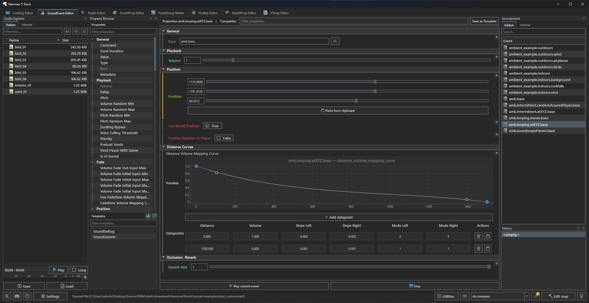

The SoundEvent Editor reads and writes the active addon's `soundevents/soundevents_addon.vsndevts` file.

## Interface

The editor provides a sound-event hierarchy, property panel, sound explorer, audio player, internal sound-file explorer, internal sound-event explorer, and undo history.

Click Create Default to create the addon's default sound-event file. Click Load File to open another `.vsndevts` file. Save changed files before switching addons or closing the tab.

## Hierarchy

Use the context menu to create, duplicate, copy, paste, or remove entries. The hierarchy supports `Ctrl+D` to duplicate, `Delete` to remove, `Ctrl+C` and `Ctrl+V` to copy and paste, and standard undo/redo shortcuts.

Choose Save as Template to store the selected event structure. Create a new event from that template through the property browser.

## Properties

Select an event to edit it in the property panel. Use the property filter to find a field. Use the property browser to add a property supported by that event.

The History panel records edits to the open file. Use it with undo and redo to return to an earlier state.

## Live preview

With <Game name="cs2"/> running and reachable over the console command pipe, the editor can send `snd_sos_stop_all_soundevents` followed by `snd_sos_start_soundevent <name>` to preview the selected event.

See [FAQ and troubleshooting](../faq.mdx#console-features-do-not-connect) when the game does not respond.

## Audio files

Use the [Audio Editor](./audio-editor.mdx) to edit WAV source audio, then add the relevant sound path to the event's properties.

The [CS2 Looping music](../../../CommunityGuides/loopingRadio/index.mdx) guide walks through both editors to build a synchronized looping sound event.

The Sound Explorer plays addon audio through the built-in player. The Play on Click setting controls whether selecting a sound starts playback.

Click an internal SoundEvent to preview it in the game. Double-click it to inspect its properties. Choose Copy to Addon to copy the event into the active addon's sound-event file.
