This guide builds a modular pipe SmartProp in <Game name="cs2"/> using `FitOnLine`, `BendDeformer`, `CreateSizer`, `CreateRotator`, and nested SmartProps.

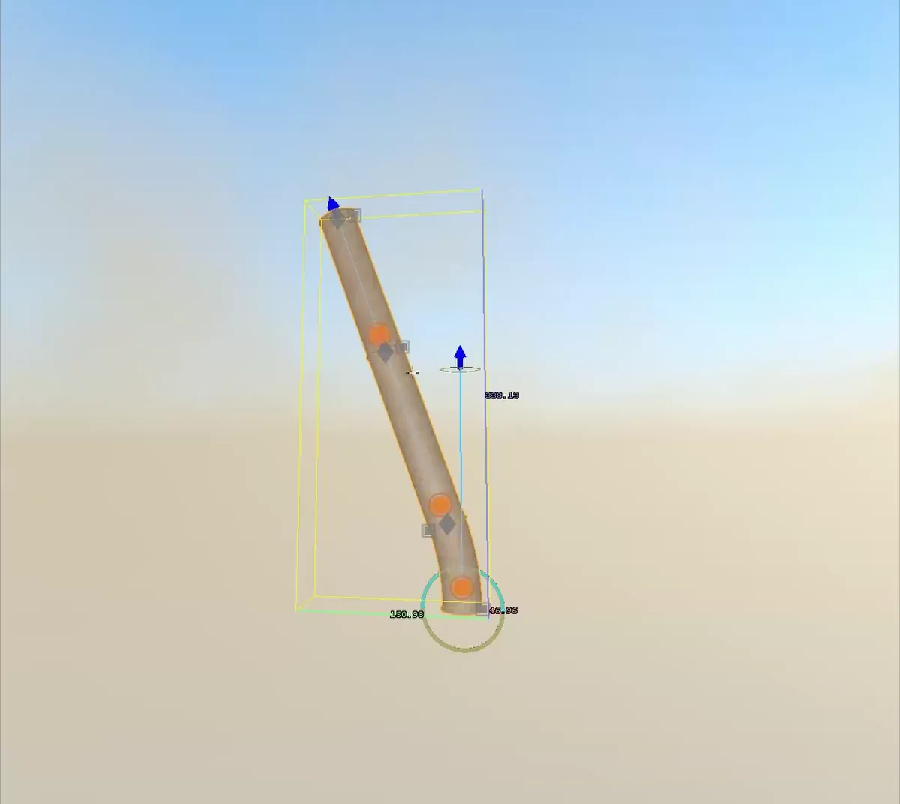

📦 [Download Pipe Mesh Kit (pipe_meshes.zip)](/downloads/hammer5tools/vsmart-examples/pipe_meshes.zip)
📦 [Download Finished guide_fitonline.vsmart](/downloads/hammer5tools/vsmart-examples/guide_fitonline.vsmart)

:::note
This guide builds on the fundamentals in the [Smart props guide](./smartprop-guide.mdx). Start there when working with SmartProps for the first time.
:::


## Mesh requirements and preparation

Before building a procedural pipe system, the source 3D meshes must be prepared according to specific guidelines:

1. Pivot Placement: Place the origin pivot at the start or end border of the mesh along the connection axis, such as Z or Y.

   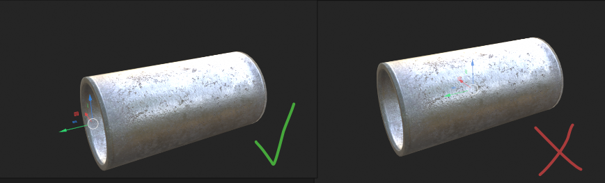

2. Subdivision Density for Bending: Straight pipe sections only need a few longitudinal segments. Meshes intended for curvature or deformation require extra edge loops along their length so they deform smoothly when passed through `BendDeformer`.

   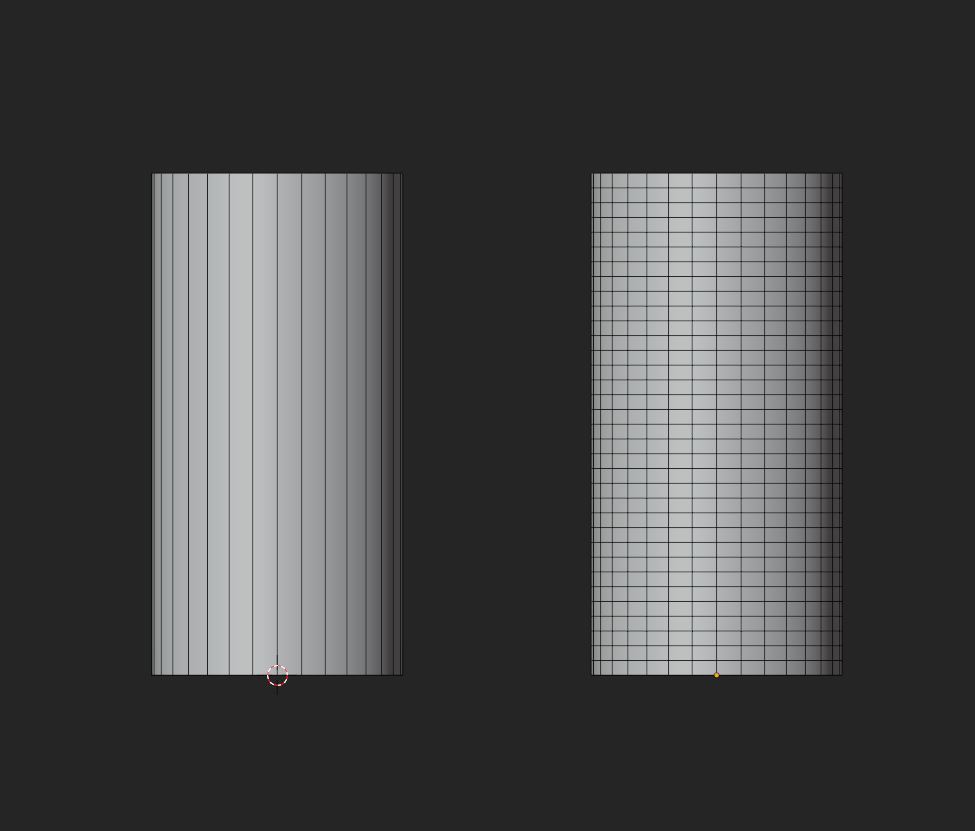

3. Grid-Aligned Sizing: Use predictable unit lengths such as 32, 64, 128, or 192 units. These values keep the length and selection criteria calculations direct.

   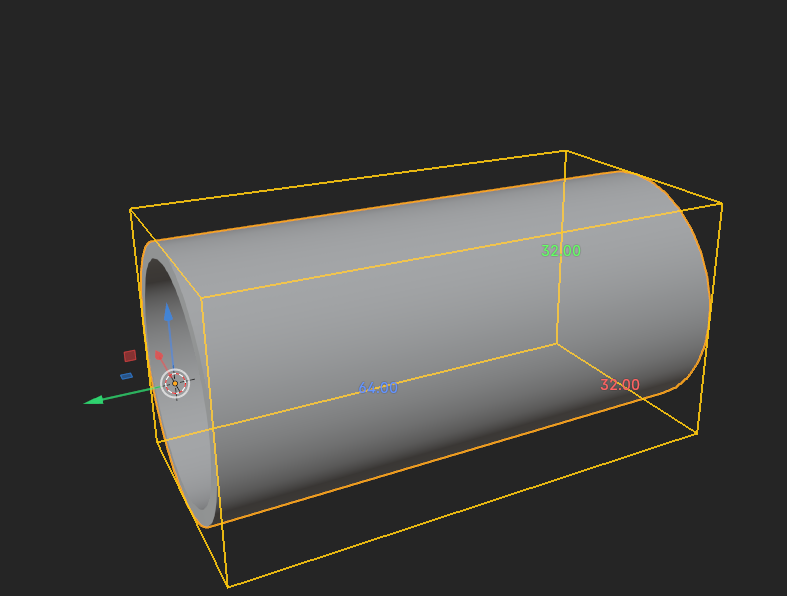

:::tip
Consistent Alignment Axis
> Align all pipe meshes along the same primary axis (for example, Z-up) with matching cross-sectional diameters.
:::

This tutorial uses a custom modular pipe kit built in Blender:

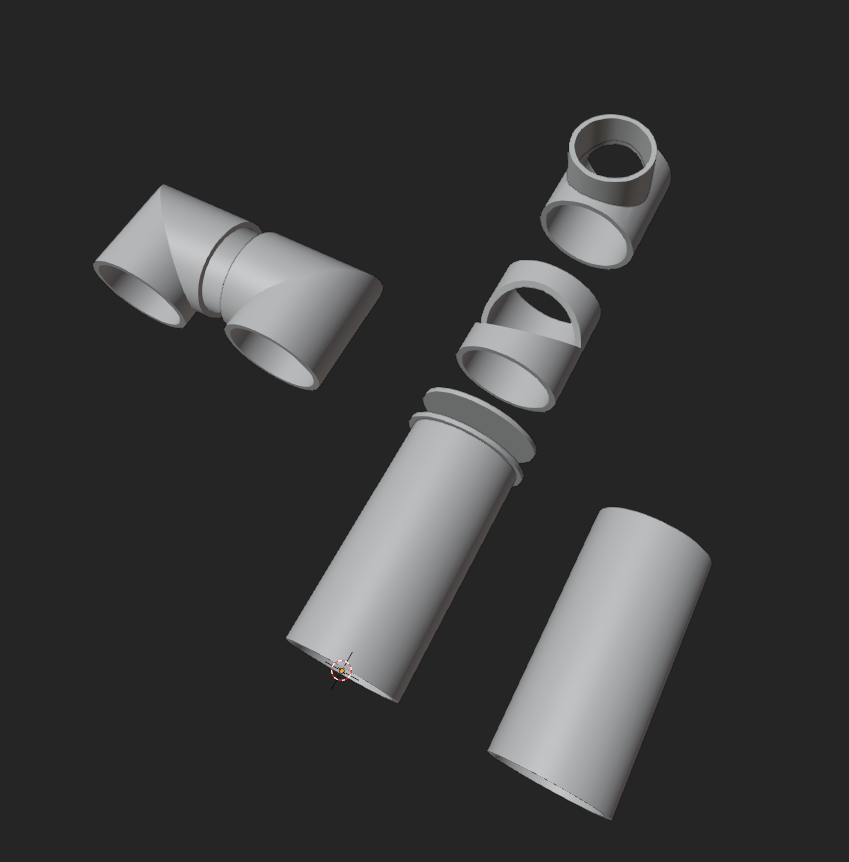


## Step 1: Import meshes with AssetGroup Maker

AssetGroup Maker batch-generates and synchronizes the models instead of requiring manual configuration of each `.vmdl` file in Hammer.

:::tip
Check AssetGroup Maker's generated files after changing a reference asset.
:::

1. Launch <Game name="cs2"/> with `-netconport 2121` (or launch via <Tool name="hammer5tools"/>).

:::note
Set `-netconport 2121` in <Game name="cs2"/> launch options when a workflow requires a NetConsole connection.
:::

2. Place the unpacked FBX files in the addon's content directory, such as `content/csgo_addons/<addon>/models/pipe_kit/`.

   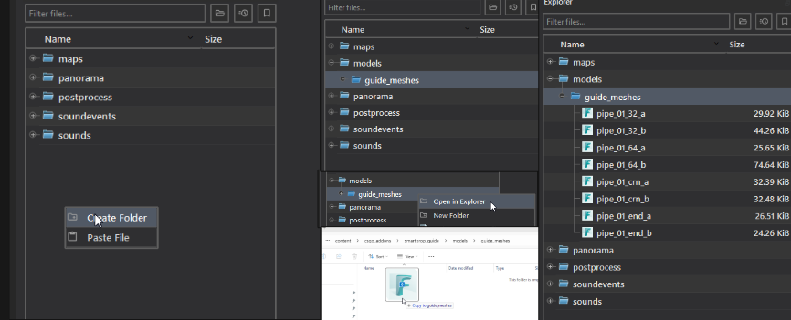

3. Select the FBX files in the <Tool name="hammer5tools"/> Explorer, right-click, and choose Quick create vmdl.
4. Select the created model and click Quick AssetGroup file to generate the `.hbat` configuration.
5. Select the `.hbat` file and click Quick process AssetGroup.

   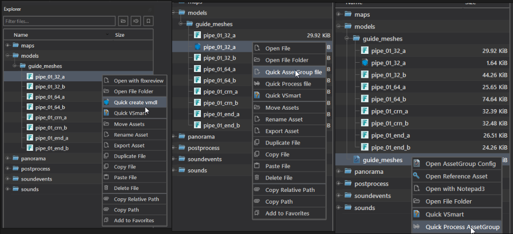

6. The `.vmdl` source files are now generated. Compile them in the <Game name="cs2"/> tools before use:

   

7. Right-click the `.hbat` file and choose Open Reference Asset. Review the generated models after changing collision hulls, physics, or material assignments:

   

   


## Step 2: Set up FitOnLine

`FitOnLine` places child elements sequentially along a line vector according to each child's LinearLength selection criteria.

1. Create a new SmartProp document in <Tool name="hammer5tools"/> and save it (e.g., `models/pipe_kit/guide_fitonline.vsmart`).
2. Import all `.vmdl` files into the SmartProp hierarchy using the Bulk Model Importer:
   - Right-click in the Hierarchy window and select Bulk Model Importer.
   - Select all the pipe `.vmdl` files.
   - Check Create ref element and click OK.

   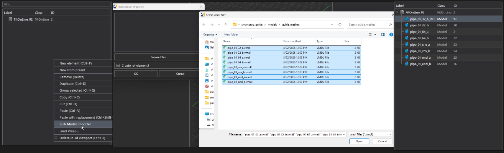

3. Move all models except `pipe_01_64_a` into a temporary group and disable that group to focus on the base piece:

   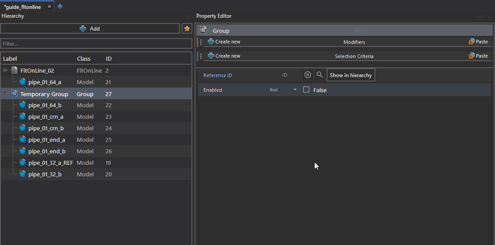

### Configure length and selection criteria
4. In the root `FitOnLine` element, set the End coordinate to `(0, 0, 128)`.
5. On the `pipe_01_64_a` model element, add a Selection Criteria: LinearLength modifier and set Length to `64`.

   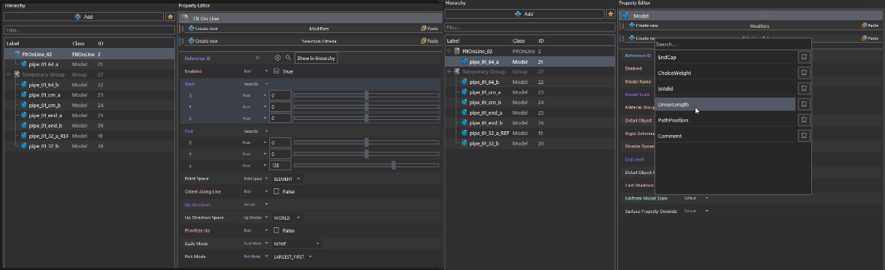

6. Place the SmartProp in Hammer to test it. Because the `FitOnLine` length is 128 and each pipe segment is 64, exactly 2 segments are placed:

   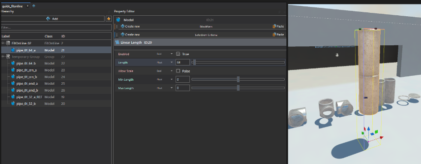

### Add an interactive sizer handle (`CreateSizer`)
7. Create a new Group element and attach a CreateSizer modifier to it.

:::tip
Modifier Grouping Best Practice
> Placing `CreateSizer` in an empty parent group keeps the hierarchy clean and prevents sizer transforms from unexpectedly shifting the local coordinate origin of the child `FitOnLine` element.
:::

8. Create a float variable named `SizerLengthZ` (uncheck *Show in editor*).
9. In the CreateSizer modifier:
   - Set Output Variable Max Z to `SizerLengthZ`.
   - Set Initial Min Z to `0` and Initial Max Z to `128`.
   - Set Constraint Min Z to `0` and Constraint Max Z to `512`.

   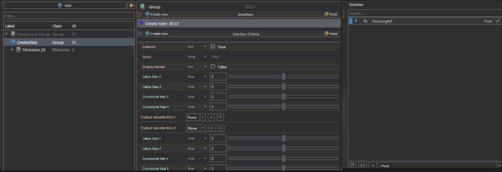

   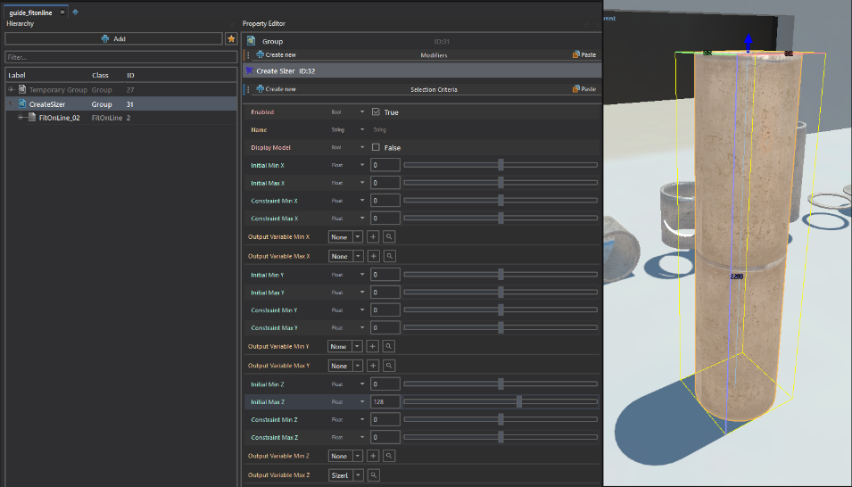

:::tip
Setting Sizer Constraints
> Always configure Constraint Min Z and Constraint Max Z on the `CreateSizer` modifier to prevent accidental inversion or excessive stretching.
:::

10. In the `FitOnLine` element, change the End.Z property from constant `128` to the `SizerLengthZ` variable.
11. In the Hammer viewport (`Shift + S`), drag the sizer arrow handle to dynamically lengthen the pipe:

    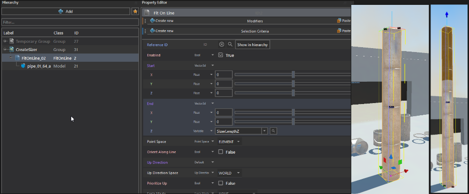

### Smooth scaling and material UV compensation
To prevent stepped gaps between fixed-size meshes, enable dynamic scaling:

12. In the `FitOnLine` element, set Scale Mode to `SCALE_END_TO_FIT` (or `SCALE_MAXIMIZE`).
13. Select the model element, switch its Model Scale (Z) field to Expression, and enter:
    ```text
    LinearScale()
    ```

:::note
What does `LinearScale()` do?
> The `LinearScale()` expression returns the scale multiplier used by `FitOnLine` to fill the remaining span. Reference it to offset child caps or connectors by the scaled dimensions.
:::

14. In the model's Selection Criteria: LinearLength, set Allow Scale to `true`, Min Length to `64`, and Max Length to `192`.

    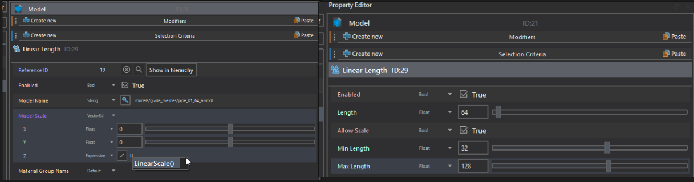

15. To prevent stretched textures when scaling pipes, enable UV scaling in the Source 2 material (`.vmat`):
    - In Material Editor, enable Scale TexCoord U By Model Scale Axis and set it to `UV.u * model.z`.

    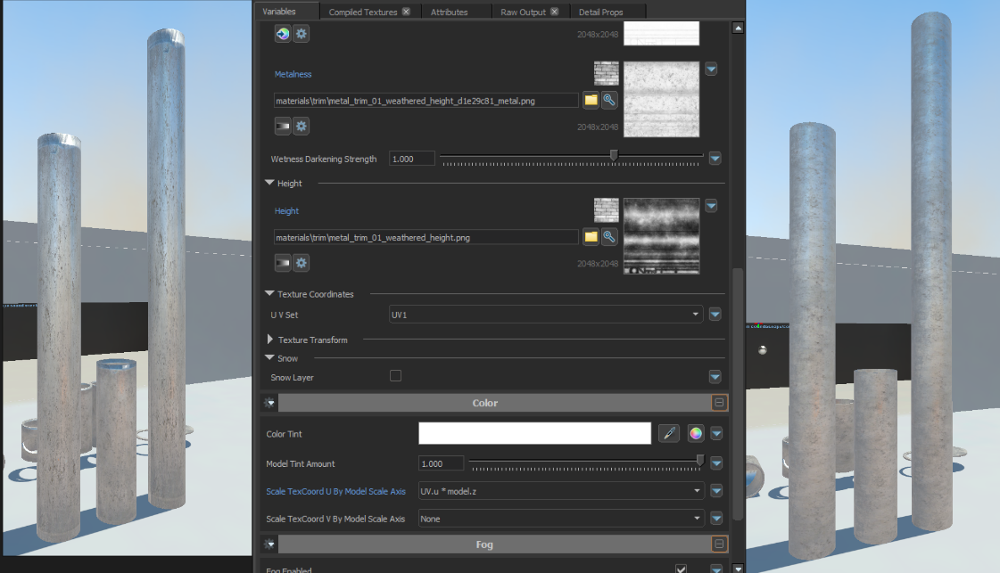

16. Adding End Caps:
    - Wrap the pipe model in a group (`Ctrl + G`) and move the `LinearLength` criteria to the group.
    - Add a `PickOne` element containing cap models (`end_a`, `end_b`) set to selection mode `FIRST`.
    - Add a Translate modifier to the cap group with Translate.Z set to `LinearScale() * 64`.

    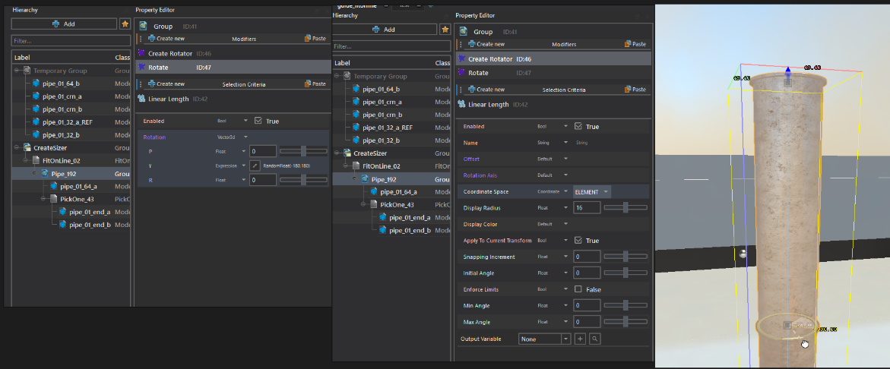


## Step 3: Branch with nested SmartProps

To allow pipes to branch and change direction, nest the SmartProp inside itself.

1. Create a `PickOne` element named End.
2. Place the Cap `PickOne` and connector meshes (`pipe_01_32_a`, `pipe_01_32_b`) under End.
3. Move the translation and a `CreateRotator` modifier to the End `PickOne` element.

   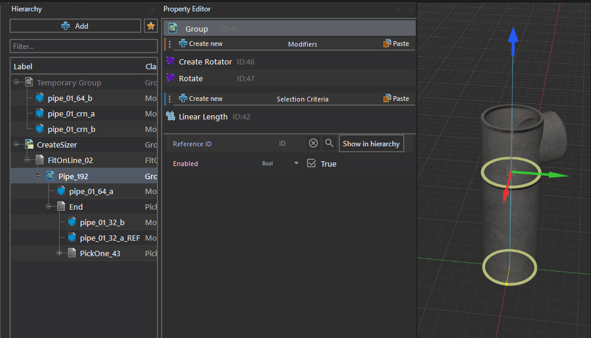

4. Self-Referencing SmartProp:
   - Add a `SmartProp` element under the End `PickOne`.
   - Set its SmartProp path to the current `.vsmart` file itself.

:::warning
Preventing Infinite Recursion
> When creating self-referencing SmartProps, always set the parent `PickOne` selection mode to `FIRST` and ensure a non-recursive terminator (like a closed cap) is the first item. Setting the selection mode to `RANDOM` will cause the SmartProp to spawn endless recursive copies upon placement, causing the editor to freeze.
:::

   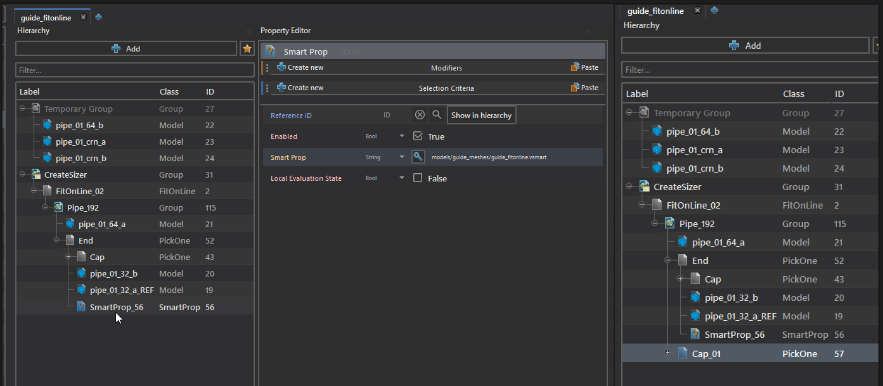

5. Customize handle shapes, colors, and offset positions for the PickOne widgets:

   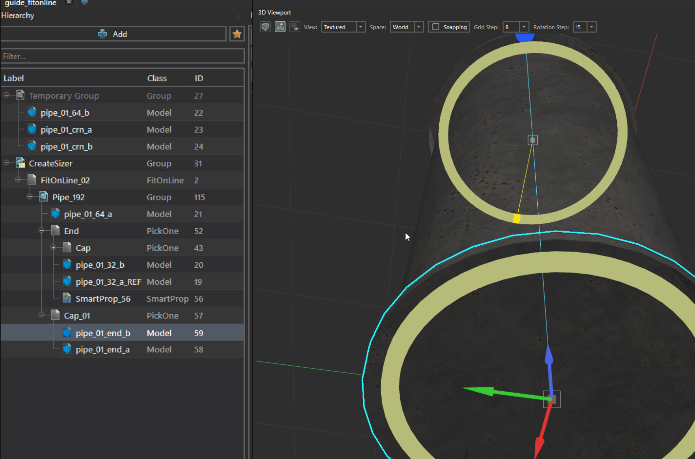

6. Configuring Branch Connectors:
   - Create a group for `pipe_01_32_b` (call it `32_b`).
   - Duplicate the `SmartProp` reference element into the `32_b` group.
   - Use viewport isolation (`Ctrl + H`) to precisely position and rotate the nested SmartProp handle to align with the branch outlet of the connector mesh.

   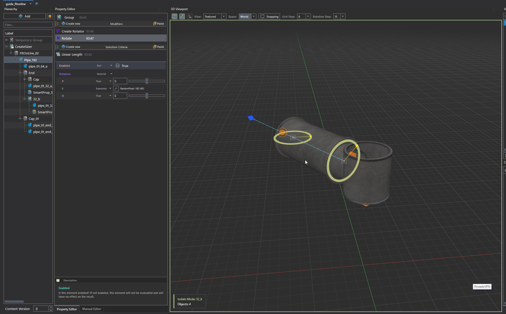

7. Repeat the same setup for 90-degree corner connectors (`pipe_01_crn_a` and `pipe_01_crn_b`):

   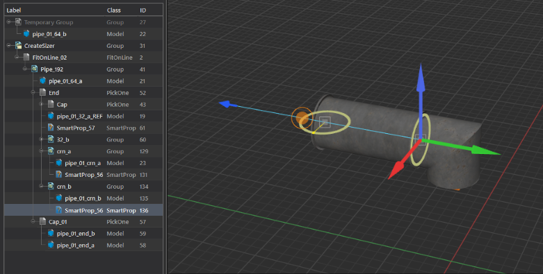


## Step 4: Create curved pipes with BendDeformer

This section introduces the BendDeformer element for smooth curved bends in Hammer.

1. Duplicate the `FitOnLine` structure and place it in a new group named Bend.
2. Wrap the model in a BendDeformer element inside the `Bend` group.
3. Attach a CreateRotator modifier to the `Bend` group:
   - Set Apply To Current Transform to `false`.
   - Set Coordinate Space to `Element`.
   - Set Rotation Axis to `(1, 0, 0)`.
   - Create a float variable named `BendAngle` and bind it to Output Variable.
   - Enable Enforce Limits with Min Angle = -90° and Max Angle = 90°.

   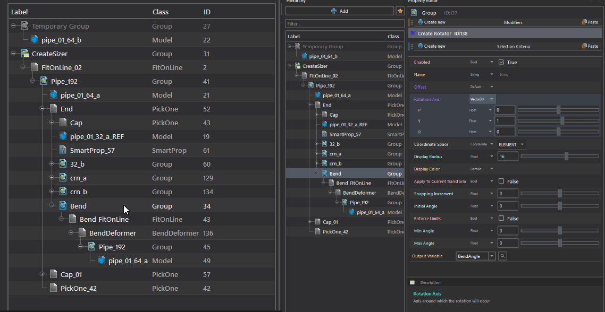

:::tip
Enforcing Angle Limits
> Always check Enforce Limits on the `CreateRotator` (`Min = -90°`, `Max = 90°`) to prevent accidental, non-physical inversions.
:::

4. Reorganize and clean up the hierarchy:
   - Move the main picker and sizer handles to the top level.
   - Ensure sizer constraints on Z are properly bounded (e.g. `Constraint Max Z = 192`).

   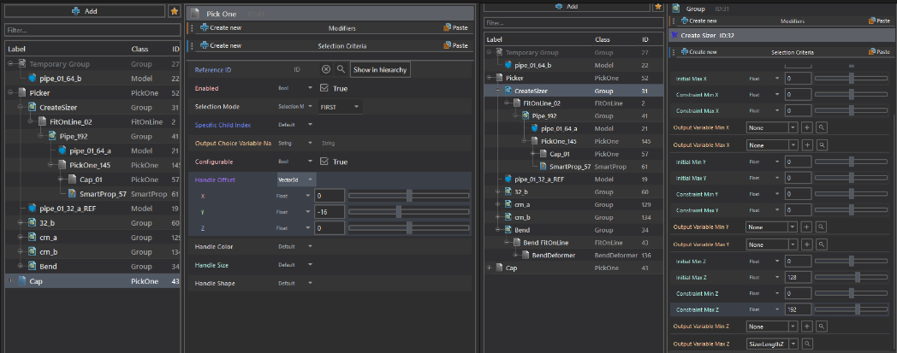

5. Configuring BendDeformer:
   - In Bend Angle, bind the `BendAngle` variable.
   - In Angles, set `(-90, 0, 0)`.
   - Set Size.X to `SizerLengthZ` (with Y and Z set to `0`).
   - Set Bend Radius to `SizerLengthZ` when the bend radius should follow the current pipe length.

   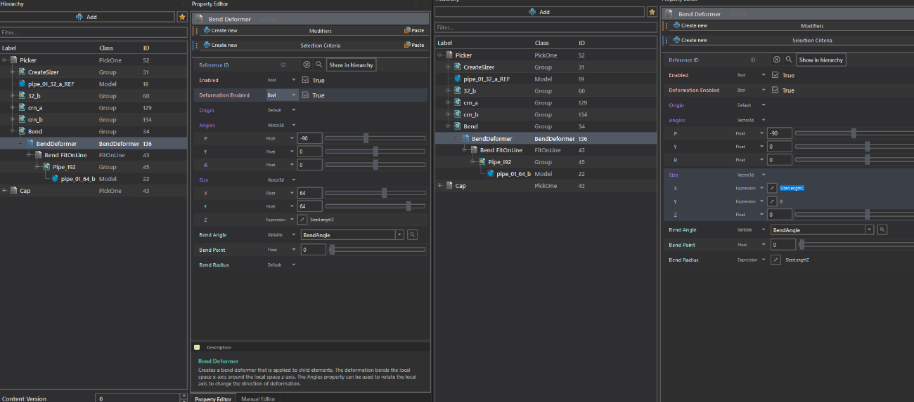

### Rigid deformation modifier

:::warning
Why is Rigid Deformation required?
> When child elements (such as `PickOne` handles or nested SmartProp instances) sit inside a `BendDeformer`, the deformation math would normally skew and distort their interactive viewport widgets into angled ellipses.
>
> To prevent this, attach a `Rigid Deformation` modifier to each control group. This preserves clean, non-deformed transform handles in the viewport while still curving the mesh geometry underneath.
:::


## Final result and workflow recap

The result is a procedural pipe SmartProp ready for testing in Hammer.


