SmartProps are an intuitive system in Source 2 used to group objects and attach procedural logic to them, such as randomization, line placement, scattering, and dynamic parameter adjustments. Think of them as smart prefabs with custom variables and interactive viewport handles.

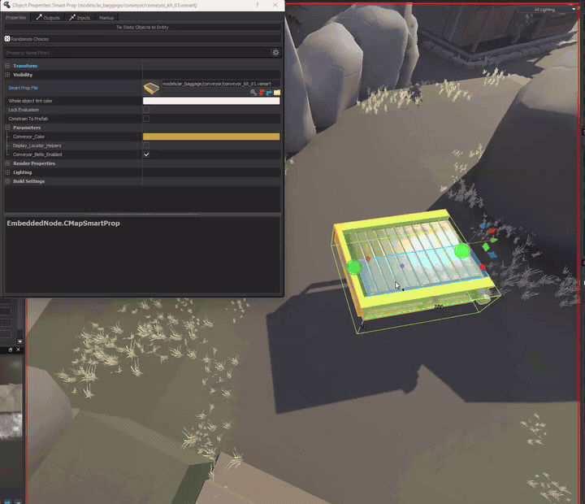

:::note
This beginner guide explains the core SmartProp concepts needed to build procedural assets with <Tool name="hammer5tools"/>.
:::


<details>
<summary>How to Use SmartProps in Hammer</summary>

Activate the Selection Tool (`Shift + S` or `Q`) in the Hammer viewport to display and interact with SmartProp control widgets.

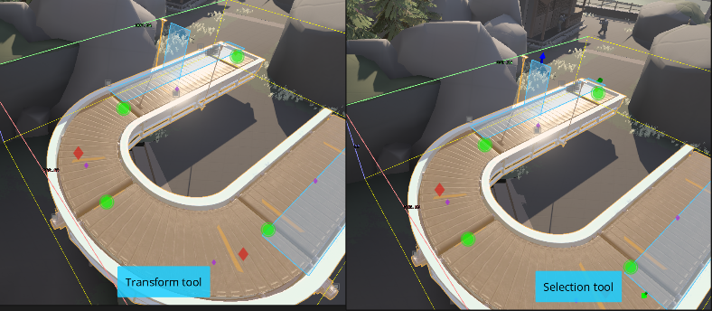

### Interactive viewport controls

SmartProps can define visual control widgets for direct manipulation inside the 3D viewport:

#### PickOne handles
Scroll the mouse wheel over circle, rectangle, or rhombus control handles to cycle through available child objects or variants.

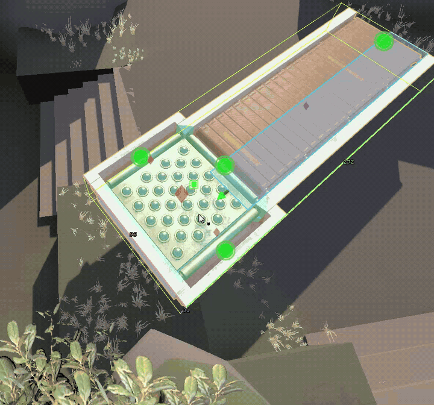

#### Sizers (`CreateSizer` modifier)
Drag arrow handles with the Left Mouse Button to interactively adjust sizer boundaries, bounding boxes, or lengths.

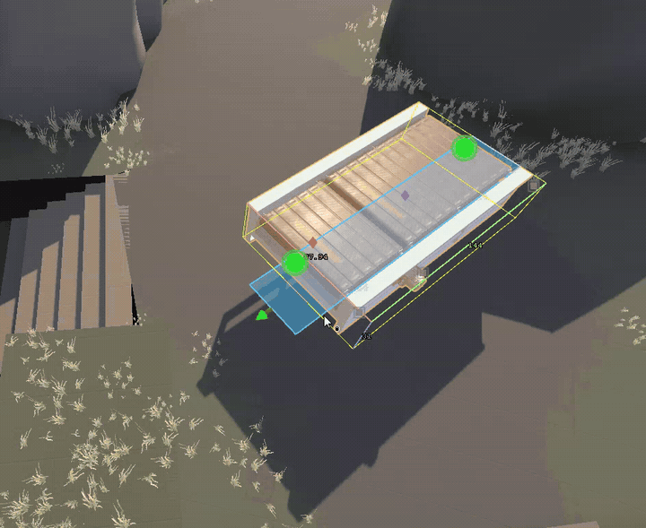

#### Locators (`CreateLocator` modifier)
Locator gizmos support translation, rotation, and scaling directly in the viewport. Each transformation mode can be enabled, constrained, or disabled per SmartProp.

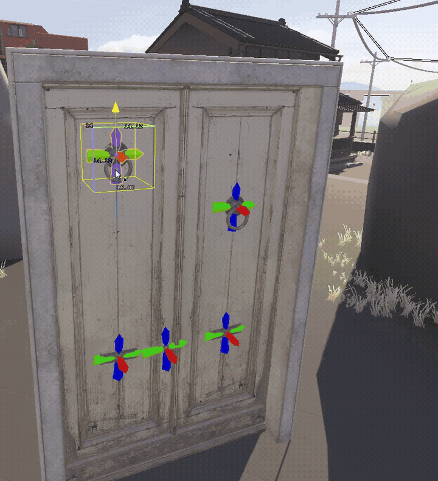

#### Rotators (`CreateRotator` modifier)
Rotation rings allow interactive rotation with degree snapping support.

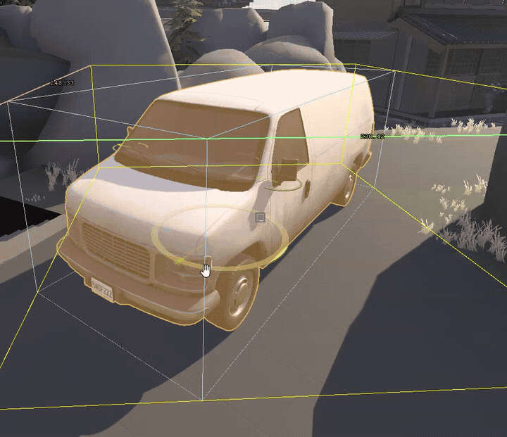

### Resetting controls
Press `Alt + M` while hovering over a visible viewport control to reset it to its default value.

### Outliner and object properties
All active SmartProp controls are listed in the Hammer Outliner under the selected entity:

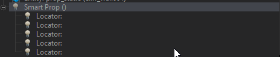

All exposed SmartProp parameters and variables appear in the Object Properties panel:

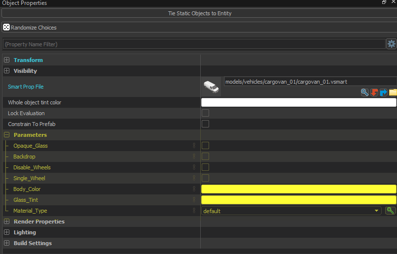

### Collapsing SmartProps into static entities
To bake a procedural SmartProp into standard static entities, right-click the prop in the viewport and select Selected smart props > Collapse Smart Props.

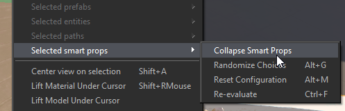

</details>


## File structure and architecture

A SmartProp is constructed from Elements, Modifiers, Selection Criteria, Variables, and Choices.

| Component | Definition | Examples |
|---|---|---|
| Elements | Core objects in the tree hierarchy. Elements can contain child elements and pass down position and rotation transforms from parents. | `Model`, `Group`, `PickOne`, `SmartProp` |
| Modifiers | Attached to elements to modify their properties (such as position, rotation, scale, or tint). Modifiers include Operators (transform state) and Filters (conditional visibility). | `Translate`, `Rotate`, `Scale`, `Filter: Expression` |
| Selection Criteria | Attached to elements to determine selection weight or matching conditions inside container elements like `PickOne` or `PlaceOnPath`. | `LinearLength`, `ChoiceWeight` |
| Variables | Dynamic parameters exposed to Hammer users in Object Properties (e.g., float sliders, checkboxes, color pickers). | `Float`, `Bool`, `String`, `Vector2D`, `Color` |
| Choices | Named value presets and dropdown menus for variables. | List of preset variants |

SmartProp files describe procedural rules and relationships for models (`.vmdl`). These definitions are stored in `.vsmart` files formatted in KeyValues3 (KV3).

<Tool name="hammer5tools"/> provides a visual editor for `.vsmart` files. Its compiler configuration applies only when <Game name="cs2"/> Hammer is launched through <Tool name="hammer5tools"/>.

### Experimental properties

:::warning
Community Hammer builds do not expose or run every experimental SmartProp schema property.
The <Tool name="s2v" label="S2V Schema Explorer" link="https://s2v.app/SchemaExplorer/cs2/smartprops/CSmartPropElement_Model"/> provides Source 2 SmartProp schema references.
:::

<Tool name="hammer5tools"/> includes the properties from the Source 2 schema. Experimental and unverified properties are hidden by default. To show them, go to Settings > SmartProp Editor and uncheck `Hide experimental properties and elements`. Report working experimental properties on Discord so they can be marked as verified.


## Hierarchy panel

The Hierarchy panel contains the tree of elements defining the current SmartProp.

- Add a new element by right-clicking in empty space or clicking the Add button in the toolbar.
- Reorder or nest elements by dragging them with the left mouse button.
- Double-click any element label to rename it.

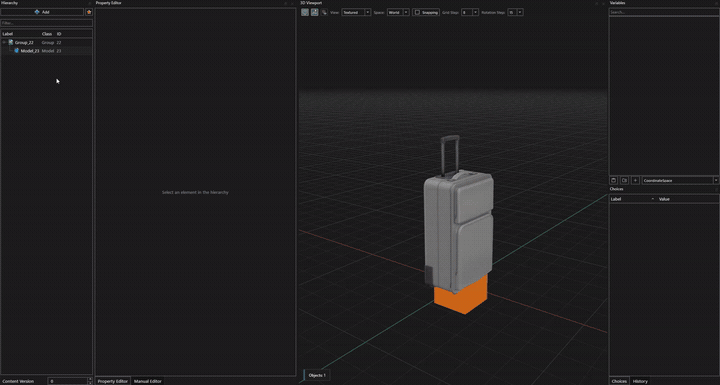

### Transform inheritance
Child elements automatically inherit the local position and rotation of their parent elements.

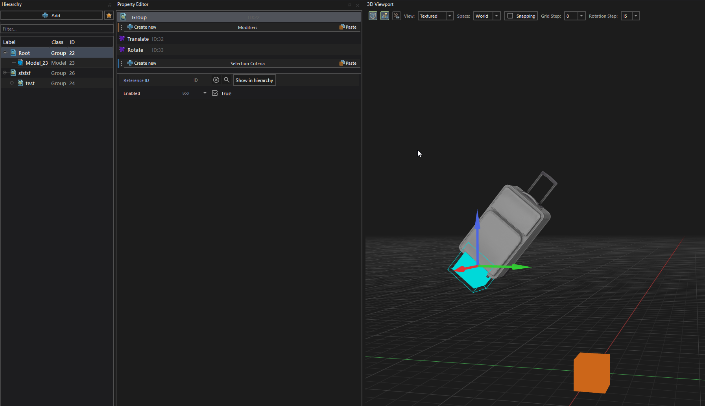


## Property editor

### Modifiers and selection criteria
Modifiers are divided into two main categories:
- Operators: Apply transformations to element properties (e.g., translation, rotation, scale, tint).
- Filters: Conditionally hide the current element and all of its children based on criteria.

Use the Create New button to add modifiers and selection criteria. Standard shortcuts manage them:

| Action | Shortcut |
|---|---|
| Copy | `Ctrl + C` |
| Duplicate | `Ctrl + D` |
| Cut | `Ctrl + X` |
| Delete | `Del` |

Use the Paste button on the right side of the panel to paste copied modifiers.

### Property modes
Each property field supports 4 distinct input modes:

1. Default: Uses the class default value.
2. Value: Direct constant value (numeric, string, vector, etc.).
3. Variable: Binds the property to a defined variable.
4. Expression: Evaluates a formula dynamically at build/evaluation time.


The Variable mode displays a dropdown list of all compatible variables and provides a quick button to create a new variable directly:

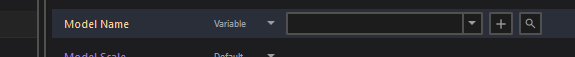

Clicking the `+` button opens the variable creation dialog:

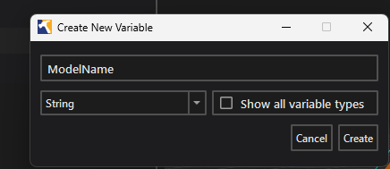

Newly created variables immediately appear in the Variables panel:


### Expression engine
The Expression field supports standard arithmetic operators (`+`, `-`, `*`, `/`), math functions (trigonometry, `min`, `max`, `abs`, `floor`, `ceil`), and ternary conditional operators (`condition ? true_val : false_val`). Open the expression editor to browse all available functions.

:::note
String property fields do not support expressions.
:::

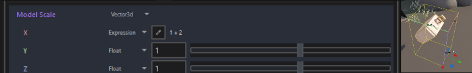


## Variables and choices

### Exposing variables to Hammer
Click the Eye icon ("Show in editor") next to any variable in the Variables panel. The variable will then appear in the entity's Object Properties panel in Hammer.


Each variable supports a default value, minimum and maximum values, and a display category.

### Choices (presets)
Choices provide convenient value presets for variables. Supported variable types include `bool`, `string`, `float`, and `int`.

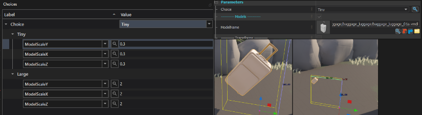


## Create a Dust 2 crate PickOne SmartProp

This tutorial builds a crate selector containing multiple Dust 2 crate models. It supports manual selection through a slider, automatic randomization, optional random scaling, and horizontal spin rotation.


 [Download dust_crate.vsmart](/downloads/hammer5tools/vsmart-examples/dust_crate.vsmart)


### Step 1: Create the root PickOne element
In the Hierarchy window, right-click and add a new element of type PickOne.

### Step 2: Add model elements
Add several Model elements as children under the PickOne element.
Toggle Dynamic Isolation in the toolbar to isolate and inspect the active model being positioned.

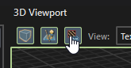

### Step 3: Name the elements
Double-click each model element in the hierarchy and give them clear, descriptive labels.


### Step 4: Expose model properties
Select a model element and expose useful properties as variables, such as Material Group, Cast Shadows, and Detail Object.
Remember to specify the model path for material group variables so Hammer knows which skins are available.

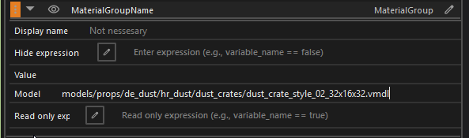

### Step 5: Organize with categories
Create variable categories in the Variables panel to keep the parameters neatly grouped in Hammer's Object Properties.


### Step 6: Configure the viewport handle
Select the root PickOne element. In the property editor, configure the handle color, shape, and offset position. Offsetting the control handle ensures it does not overlap with Hammer's standard translation gizmo.

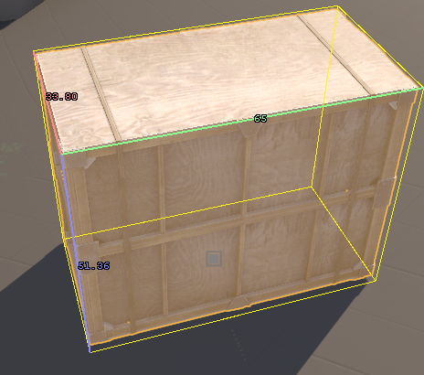


The control handle will now appear cleanly next to the prop in the viewport:

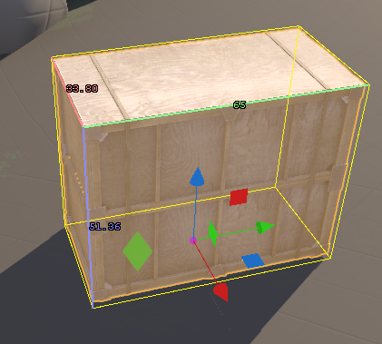

### Step 7: Create the selection switcher
Add a toggle that switches between random selection and manual slider selection.
In the Variables panel, expose:
- `SelectionMode` (bound to the PickOne selection mode property)
- `SpecificChildIndex` (bound to the specific child index property)

### Step 8: Set the index range
Set the Min and Max bounds for the `SpecificChildIndex` variable. For 3 child models, set Min = 0 and Max = 2 (since index 0 is the first model).

### Step 9: Disable the slider conditionally
The slider should be active only when `SelectionMode` is set to `SPECIFIC`.
In the `SpecificChildIndex` variable settings, set the Read-only Expression to:
```text
SelectionMode != 'SPECIFIC'
```


The selection logic is configured.

### Step 10: Add randomization modifiers
To add variation, attach Random Scale and Random Rotation modifiers to the root element.


### Step 11: Add randomization toggles
Create two boolean variables to let mappers turn randomization on or off:
- `EnableRandomScale` (default: false)
- `EnableRandomRotation` (default: false)

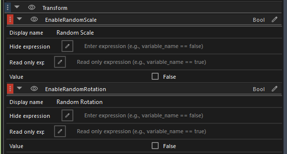

### Step 12: Expose scale parameters
Expose the Min Scale and Max Scale properties in the Random Scale modifier, and bind its Enabled property to `EnableRandomScale`.

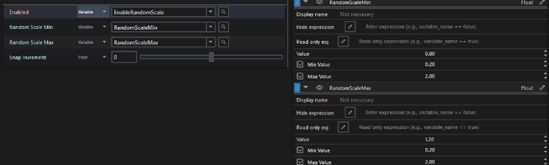

### Step 13: Create a Vector2D variable for rotation
Rotation requires only the Z, or spin, axis. Create one Vector2D variable instead of separate minimum and maximum float variables:
- `X` = Minimum spin angle
- `Y` = Maximum spinangle

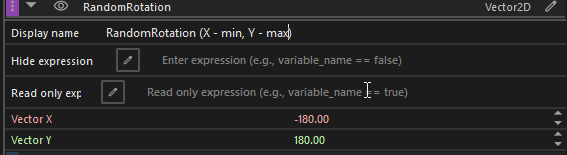

### Steps 14 and 15: Split vector expressions
In the Random Rotation modifier, switch the Z min and max rotation fields to Expression mode. Use expressions to reference the split components:
- Min Z Rotation: `RotationRange.x`
- Max Z Rotation: `RotationRange.y`


:::tip
Drag horizontally with the mouse wheel over numeric input fields in Hammer Editor to adjust values smoothly.
:::

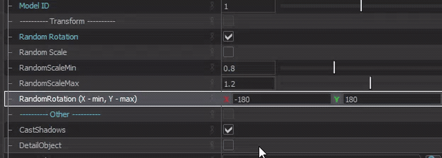

Save the SmartProp and place it in a <Game name="cs2"/> map.
