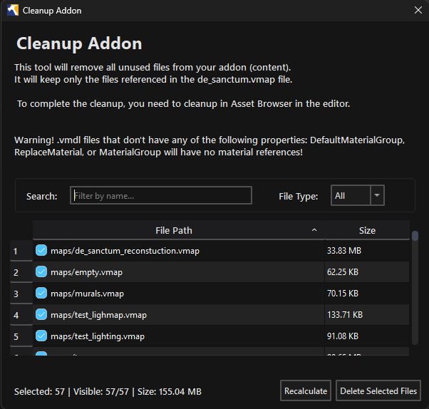

Cleanup Addon lists content files that the addon's main map, `maps/<addon>.vmap`, does
not reference, directly or through the assets it reaches.

Open it from Utilities > Cleanup Content.

## Scan

Enable Scan source mesh files (.fbx, .dmx) for material references when source meshes contain material names that must be kept.

Files listed in the addon's `.dirtlist` are excluded from cleanup. Click
Open .dirtlist to open that text file in the system editor. <Tool name="hammer5tools"/> creates
the file with instructions if it does not exist. Save it and click Recalculate
to apply changes. Use Search / Filter by name and File Type to narrow the results.

Click Recalculate after changing the addon content. The summary shows the scanned files and cleanup candidates.

## Review files

Use the checkboxes to choose files. Right-click selected rows to choose Check Selected,
Uncheck Selected, or Open File Location.

Click Verify to compile the main VMAP and the referenced VMAPs found by the scan.
The verification dialog reports map compilation failures and missing references. Resolve
them, then recalculate and review the list again.

## Delete files

Click Delete Selected Files. Read the confirmation and check the listed paths before continuing.

## Clean the VRAD3 cache

Choose Utilities > Cleanup _vrad3 cache to remove cached VRAD3 data from every
addon that currently has an `_vrad3` directory under `game/csgo_addons`. The
confirmation dialog lists all affected addons. Run new lighting builds for them
afterward.

:::warning
Delete Selected Files permanently removes the checked content files. It has no undo.
Commit or back up the addon before deleting anything.
:::
