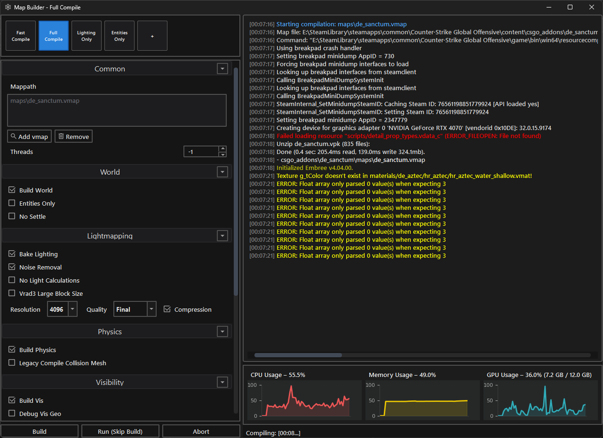

Map Builder runs `resourcecompiler.exe` for Source 2 map files and records compiler output.

## Presets

Presets store the selected build options. The built-in presets include Fast Compile, Full Compile, Lighting Only, and Entities Only. Review the selected options before building; the command line is assembled from those options.

Create a preset to store the current fields. Settings in every preset, including a
supplied preset, can be updated. Only custom presets can be renamed or deleted; the four
supplied preset names cannot.

## Build options

The form exposes options for world, entities, physics, lighting, visibility, navigation, reverb, sound paths, and grid navigation. Lighting options include VRAD quality, maximum lightmap resolution, filtering, and large block size.

`-lightmapDisableFiltering` is supplied when lightmap filtering is disabled.

Build World, Entities Only, Build Vis Geometry, and No Settle control the map stage. Physics options are Build Physics and Legacy Compile Collision Mesh.

Lighting options control the bake, quality, compression, filtering, resolution, lighting calculations, and large block size. Visibility and navigation have separate build and debug options.

Audio options are Build Reverb, Build Paths, Bake Custom Audio, and Audio Threads. Build Cubemaps, Cleanup _vrad3 cache, Save Build Logs, and Load In Engine After Build run their named actions.

The Cleanup _vrad3 cache build option applies to addons represented in the current
build queue. This is different from Utilities > Cleanup _vrad3 cache, which scans all
addons under `game/csgo_addons`.

## Queue and output

Add one or more map paths to the queue. Remove a path when it is not part of the next build. Save a map path to keep it in the list between sessions.

Click Build to compile the queued maps. Click Run (Skip Build) to launch the selected map without compiling it. Click Abort to stop the running compiler process.

Map Builder shows the compiler output and last build time. When Save build logs is enabled, it also writes the output to a log file.

## Skybox maps

For filenames ending in `skybox`, Map Builder sets the maximum lightmap resolution to 2048 and disables navigation and visibility builds.
