## Description

CS2 detail props VDATA file format.

Detail Props are non-solid models placed on environment blend shader materials automatically.

## Fields

---

### CDetailPropType

The first parameter defined (in this example, `rubble_detail`) is the name of the detail type which will be selectable, you can name this anything you want. 

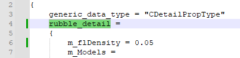

---

### m_flDensity

The second parameter defined is `m_flDensity = 0.05`

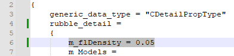

This value defines the density coverage of models placed on your material per square foot.

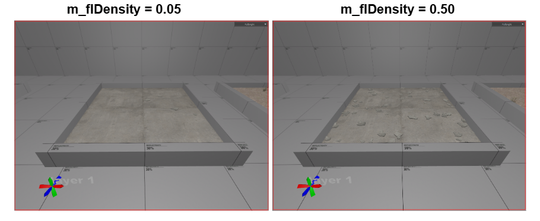

---

### m_ModelName = resource_name:

Moving on to the second segment, the first parameter is the model file location.
`m_ModelName = resource_name:`

You can find the model path using the asset browser. Replace the file path with the model you wish to use.

---

### m_MaterialGroup

The next parameter defined is the material group (or skin) to use for the model chosen.
`m_MaterialGroup = "default"` 

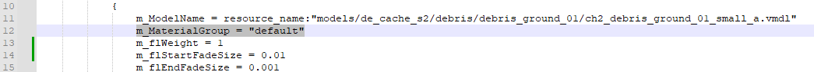

The debris model has 2 skins to choose from. For the example default was chosen.

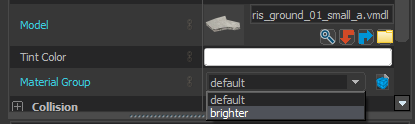

---

### m_flWeight

Moving on, the next parameter is `m_flWeight = 1`

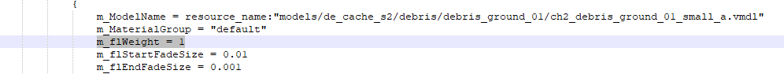

This parameter is a weight that determines the frequency of this model being placed relative to other models in the detail type. Since there is only 1 model for the `rubble_detail` detail type, the value is 1. 

:::info
As an example, below the first model is weighted to be placed 96% of the time, while the second model is weighted to be placed 4% of the time. Taken from the `grass_detail` detail type in the example.
:::

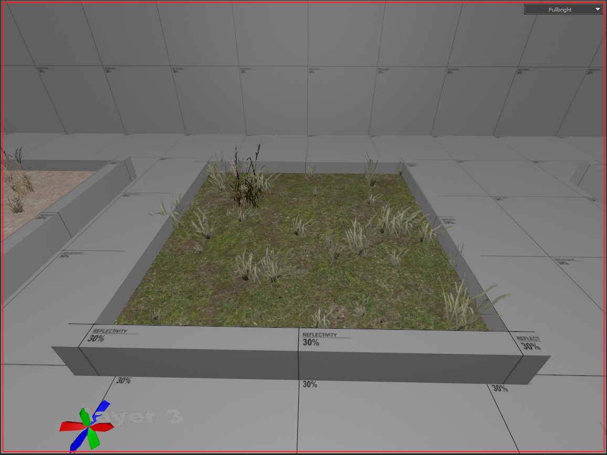

---

### m_flStartFadeSize - m_flEndFadeSize

Next, we have 2 parameters for the start and end of fade size. 

`m_flStartFadeSize = 0.01`    models smaller than 0.01 of screen space will begin to fade.

`m_flEndFadeSize = 0.001`     models smaller than 0.001 of screen space will finish fading.

Make sure to noclip around to see the fading in action. Keep in mind that fade size is directly affected by the size of the models. You will notice this difference between layer 2 and layer 3 examples.

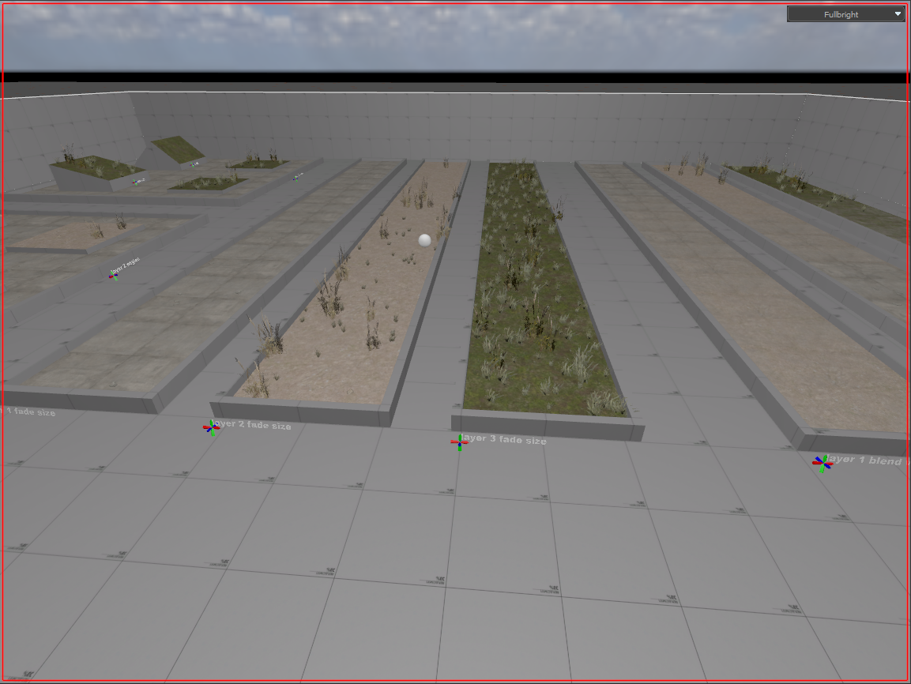

---

### m_bWorldSpaceOrientation - m_flOrientToSurface

The 2 parameters following simply describe how your models decide which way is up.

`m_bWorldSpaceOrientation = true`

When true, the model will use world space to align its Z direction, so as not to affect surface slope filtering.

`m_flOrientToSurface = 1.000000`
When set to 1.0 this tells the model to match its Z up direction to the surface. 

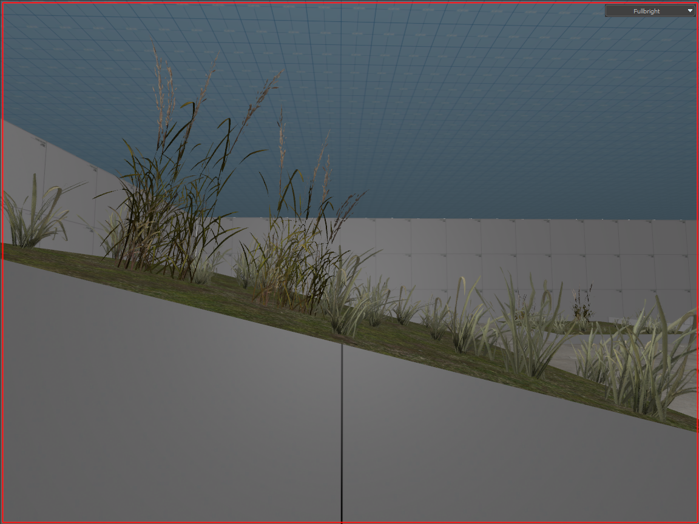

---

### m_flMinSurfaceSlope - m_flMaxSurfaceSlope

These 2 parameters define the min and max range of surface angles for model placement. 

:::info
Slope can range from 0 - 180 degrees. Where 0 is horizontal, 90 is a vertical wall, while 180 would be an upside down surface like the ceiling!
:::

---

### m_flRandomVerticalOffset(Min/Max)

The following parameters are for defining a desired range of random vertical offsets to apply for placement of models. In the example both are set to 0 for surface visuals.

An example with `m_flRandomVerticalOffsetMin = 10.0` and `m_flRandomVerticalOffsetMax = 50.0`: 

---

### m_vRandomRotation(Min/Max)

These 2 parameters describe the min and max random rotation angles applied to models local space in `pitch, yaw, roll`.

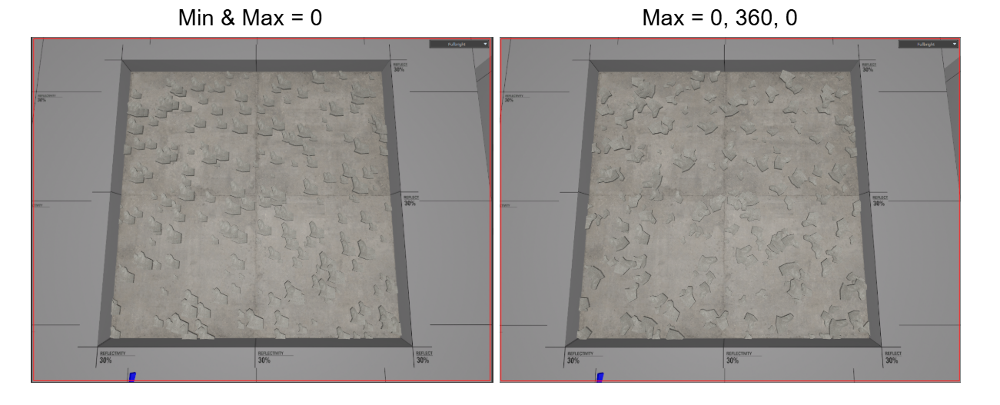

---

### m_flRandomScale(Min/Max)

Like the previous, these two define the random min scale and random max scale to apply to models.

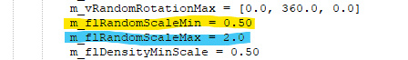

Below you can see the debris model ranges from a scale of 0.5 - 2.0 as defined.

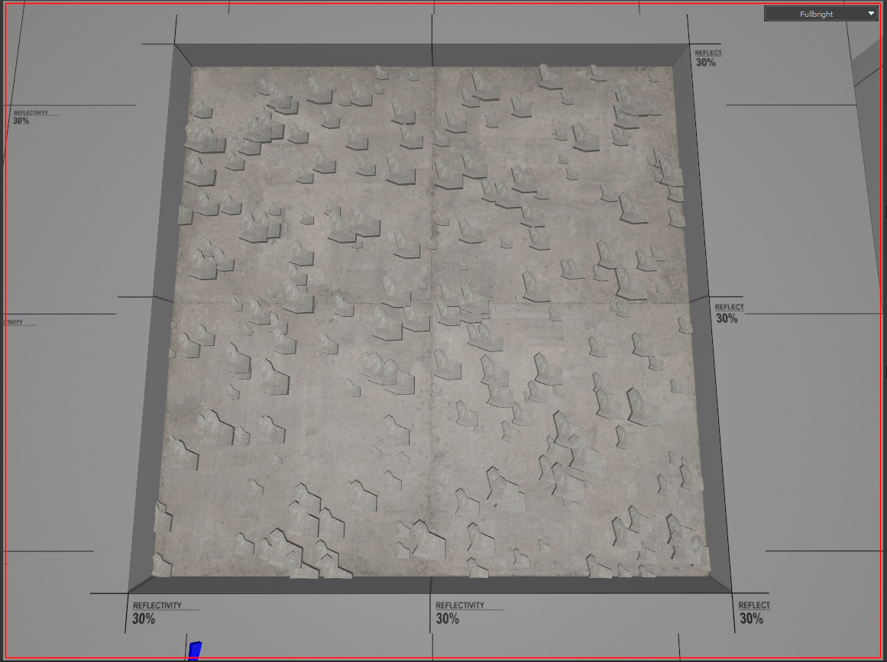

---

### m_flDensityMinScale

This defines the minimum density scale to apply to models for blended detail density placement. 

:::warning
This value is multiplied with `m_flRandomScaleMin` AND `m_flBlendWeightMinScale` to determine the final minimum scale of model placement.
:::

In the example, all three of the following parameters are set to the same value of `0.50` to ensure the minimum scale of model density placement is `0.50`

`m_flRandomScaleMin = 0.50`

`m_flDensityMinScale = 0.50`

`m_flBlendWeightMinScale = 0.50`

---

### m_flBlendWeightMinScale - m_flBlendWeightMin

These 2 parameters are tied to each other. 

`m_flBlendWeightMinScale` defines the minimum scale for model placement.

`m_flBlendWeightMin` defines the minimum blend coverage for model placement.

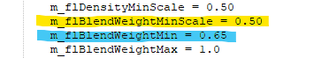

In the example of detail type `grass_detail` , the 2 models are placed at a minimum scale of `0.50` when blend coverage reaches `65%`.

---

### m_flBlendWeight(Min/Max) - m_flBlendWeightFullDenstity

:::note
With 1 of the previous parameters, all 3 of the above are to describe a range from which blend weight should models be placed and what blend weight should model placement be full density. 

:::

`m_flBlendWeightMin = 0.65` defines the minimum blend weight that models will begin to be placed in is 65% for the example. 

`m_flBlendWeightMax = 1.0` defines the maximum blend weight that models will be placed in is 100% for the example. 

`m_flBlendWeightFullDenstity = 0.80` defines that only at 80% blend weight will models be placed at full density.

With the environment blend shader opened in the Material Editor, we can better visualize this with `Visualizations` enabled to `Show Blending`.

---

### m_bCastStaticShadows

Defines whether or not the models placed in the detail type should cast static shadows or not. This is important to remember that if set to True like the example, the static shadows will persist whether the models are visible or not from their defined fade distances!

Notice in the example that past the fade distance, the static shadows are still visible. Keep this in mind for your use case!

---

