Every page on this wiki is a markdown file in the <Tool name="github" label="Source2Wiki" link="https://github.com/Source2Wiki/Source2Wiki"/> repository. Editing the wiki means proposing a change to that repository, and for most small edits that takes nothing but a free GitHub account, no downloads or setup.

A proposed change is called a pull request. A maintainer looks it over, merges it, and the site rebuilds itself, your edit is live a few minutes later.

## Editing an existing page

1. Scroll to the bottom of the page and click **Edit this page**. It opens the page's source file on GitHub.
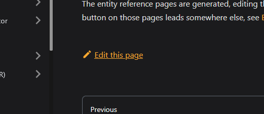

2. Click the pencil icon in the top right of the file view. If this is your first edit, GitHub asks to fork the repository, accept it, that is your personal copy to edit.
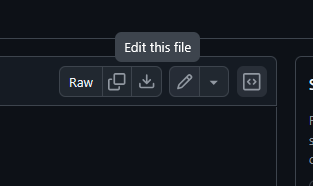
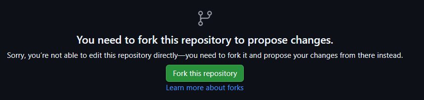

3. Make the change in the editor. The **Preview** tab shows roughly how it will render, however it doesn't support any docusaurus specific features.
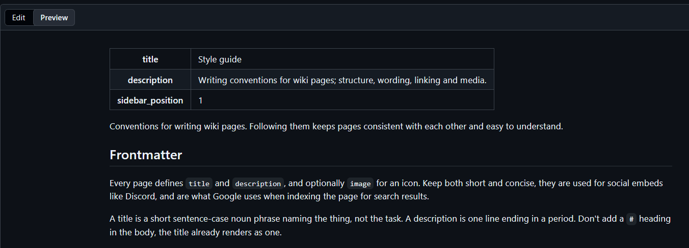

4. Click **Commit changes**, write a short line saying what you changed, and follow the prompts until GitHub opens the pull request.
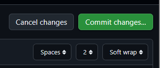
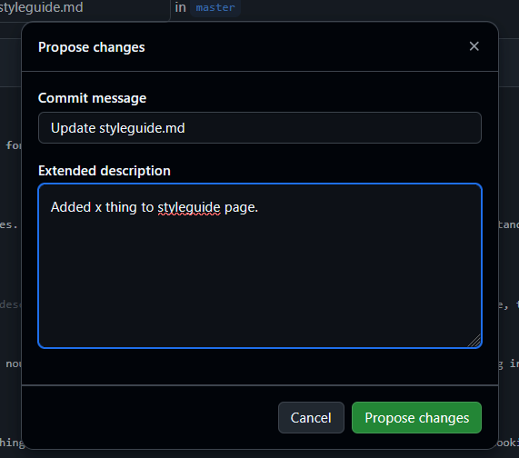

That is the whole process. Typo fixes, wording improvements and small corrections are always welcome, they do not need to be big to be worth a pull request.

## Creating a new page

A page is a `.md` file inside the [`docs/`](https://github.com/Source2Wiki/Source2Wiki/tree/master/docs) folder of the repository, and the folder it sits in decides which sidebar section it appears under. New files can be created straight from the browser too: Simply swap `.com` with `.dev` in the url bar of your browser, this will open the wiki repository in a Visual Studio Code window straight in your browser.

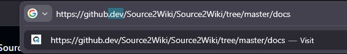
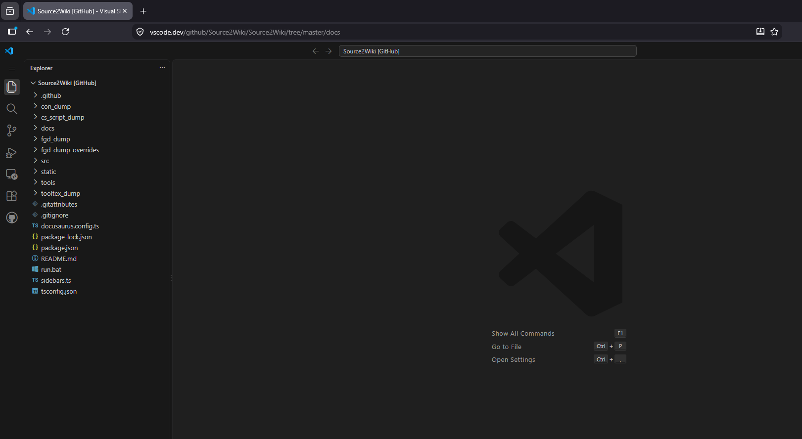


Every page starts with a small frontmatter block, followed by the content:

```md
---
title: My new page
description: One line saying what the page covers.
---

The first sentence defines what the page is about.
```

Before writing, read the [Style guide](./styleguide.md), it is short and keeps pages consistent with the rest of the wiki. [Annotations](./annotations.md) and [Software badges](./software.mdx) cover the extra markup available beyond plain markdown.

## Bigger changes

For anything larger, a new section, lots of screenshots, or edits across many pages, it is easier to run the wiki locally, this allows you to have a live preview of the actual site, but needs some knowledge of how to use git. The steps below use GitHub Desktop, which handles git through a normal app instead of the command line.

### Installing GitHub Desktop

Download <Tool name="github" label="GitHub Desktop" link="https://desktop.github.com/"/>, install it and sign in with the same GitHub account used for browser edits.

### How to clone the wiki

Cloning downloads the repository to your computer:

1. In GitHub Desktop, pick **File**, then **Clone Repository**.
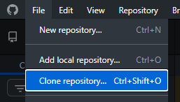

2. Switch to the **URL** tab, paste `https://github.com/Source2Wiki/Source2Wiki`, choose where to put it and click **Clone**.
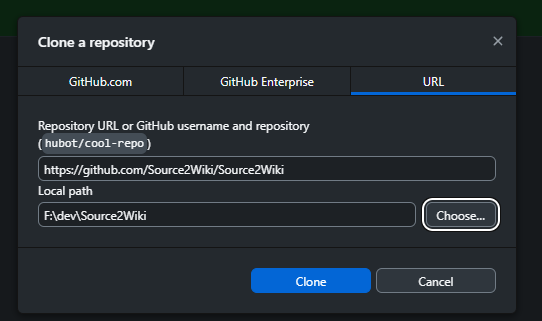

To see the wiki running, open the cloned folder and double click `run.bat` if on windows.

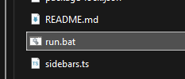

That installs whatever is missing (incouding Node) and starts a local version of the site at `localhost:3000` that live-reloads as files are saved. 

Otherwise, `npm start` does the same thing without installing Node first, if you don't have it installed you will need to download it first.

### Committing your changes

A commit is a saved snapshot of your edits with a short message saying what changed:

1. In GitHub Desktop, pick **Branch**, then **New Branch**, and give it a short name describing the change, like `update-deadlock-info`. Branches keep each pull request separate.
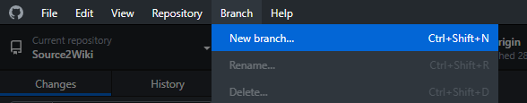

2. Edit the wiki files in any editor, every changed file shows up in the left panel of GitHub Desktop.
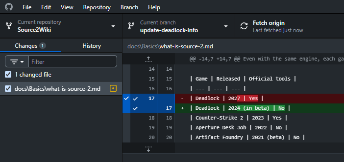

3. Tick the files that belong to the change, write a one-line summary in the box at the bottom left, and click **Commit**.
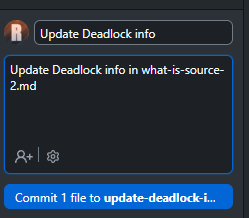

### Making a pull request

1. Click **Push origin** at the top of GitHub Desktop, this uploads the commits to your fork.
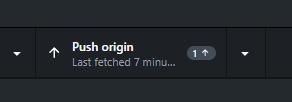

2. Click **Create Pull Request**, it opens GitHub in the browser with everything prefilled.
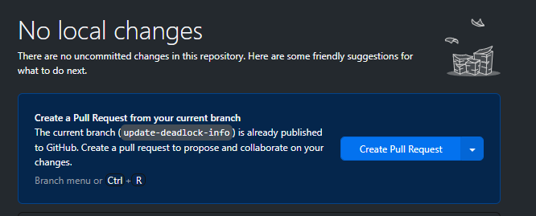

3. Describe what the change does and click **Create pull request**.
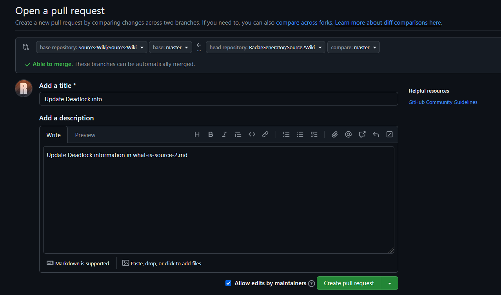

From here it is the same as browser edits: a maintainer reviews it, merges it, and the change goes live.

## Entity pages

The entity reference pages are generated, editing their files directly gets overwritten. Changes to them go through override files instead, which is why the edit button on those pages leads somewhere else, see [Entity page info](./entity-page-info.mdx).
